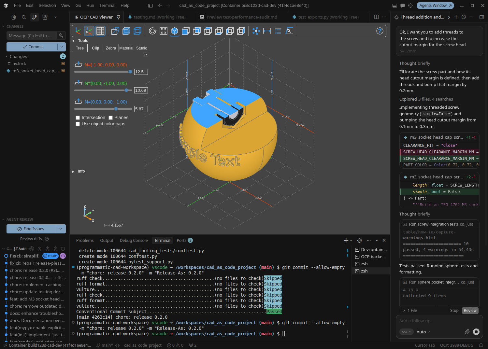

# CAD-as-Code, in a box

<!-- template:pages-badge:start -->
[](https://coffee2bits.github.io/CAD-as-Code-Template/)
<!-- template:pages-badge:end -->

This is a highly-opinionated turn-key workspace that brings software practices to parametric CAD like linting, testing, containerized workspaces, and CI/CD pipeline practices to give you versioned source files, repeatable builds, tests, reviewable changes, and release artifacts with the benefits of automation.

Start from a Dev Container, model with [build123d](https://build123d.readthedocs.io/) and your choice of AI agent, preview in the [OCP CAD Viewer](https://github.com/bernhard-42/vscode-ocp-cad-viewer), test with pytest, export STEP/STL/GLB files, and publish releases through a CI/CD pipeline. The Python in `cad/` is the source of truth. Meshes, renders, BOMs, and other manufacturing files are automatically generated outputs.

If you are new to software-style workflows, that is the point of the template: the non-CAD pieces are all here and configured so your CAD work is repeatable, inspectable, and automated so that you can focus on design and modeling.


<small><em>The default workspace: source code, live model preview, and agent assistance sharing the same containerized CAD environment.</em></small>



<small><em>A Z-axis section cut through the demo sphere, showing how the viewer exposes embedded hardware, pockets, and interior clearances.</em></small>

## Start here

- [Use this template](https://github.com/Coffee2Bits/CAD-as-Code-Template/generate) to create your own CAD repo.
- [Open the docs](https://coffee2bits.github.io/CAD-as-Code-Template/) for the full guide.
- [Follow the quick start](https://coffee2bits.github.io/CAD-as-Code-Template/getting-started/quick-start) if you want the shortest path from clone to working model.

## Why CAD-as-Code?

Traditional CAD files hide intent inside binary documents. That makes changes harder to review, test, automate, and reproduce.

CAD-as-Code puts the model definition in readable source code, a perfect format for LLM agents to interact and reason about your models. A radius, hole pattern, bracket height, or assembly of shapes becomes a series of relationships with properties, parameter, or functions. That means a parametric CAD project can use the same habits that make software projects reliable:

- Source control tracks every change to the model.
- Tests catch broken geometry before a release.
- Linting and type checks keep the codebase maintainable.
- The CI/CD pipeline runs the same checks locally and on GitHub.
- Release jobs regenerate manufacturing artifacts from source.
- Agents can inspect the code, run commands, and use viewer feedback without guessing at hidden CAD state.

This repo is not just a quick AI CAD sandbox. It is an opinionated starter kit for treating parametric CAD as a software project.

## What you get

- Python parametric CAD with [build123d](https://github.com/gumyr/build123d) on [Open CASCADE](https://coffee2bits.github.io/CAD-as-Code-Template/reference/open-cascade).
- A portable [Dev Container](https://coffee2bits.github.io/CAD-as-Code-Template/getting-started/dev-container) for VS Code, Cursor, Codespaces, and other compatible workspaces.
- Live model preview through [OCP CAD Viewer](https://coffee2bits.github.io/CAD-as-Code-Template/getting-started/ocp-viewer).
- Repeatable commands through [just](https://coffee2bits.github.io/CAD-as-Code-Template/tools/just).
- Geometry tests, linting, type checks, and dead-code detection.
- STEP, STL, GLB, and release artifact workflows.
- [MakerRepo](https://coffee2bits.github.io/CAD-as-Code-Template/tools/makerrepo) decorators and CLI support for artifact discovery and export.
- [Dagger + GitHub Actions](https://coffee2bits.github.io/CAD-as-Code-Template/workflows/ci-and-dagger) for a portable CI/CD pipeline.
- Agent-ready hooks through [MCP servers](https://coffee2bits.github.io/CAD-as-Code-Template/tools/mcp-servers) inside the container.

## One-click get started

Fastest path:

1. Click [Use this template](https://github.com/Coffee2Bits/CAD-as-Code-Template/generate).
2. Open the repo in GitHub Codespaces, VS Code, Cursor, or another [Dev Containers-compatible workspace](https://coffee2bits.github.io/CAD-as-Code-Template/getting-started/ide-and-workspaces).
3. Let the container build. Dependencies and local docs start automatically.
4. Run the first checks:

```bash
just test
just view
just mr-artifacts
```

What should happen:

- `just test` runs the Python test suite.
- `just view` opens the demo sphere in the OCP CAD Viewer.
- `just mr-artifacts` lists the exportable MakerRepo artifacts.

Full setup, local Docker notes, MCP notes, and first-release setup live in the [quick start](https://coffee2bits.github.io/CAD-as-Code-Template/getting-started/quick-start).

## Where to go next

- [Quick start](https://coffee2bits.github.io/CAD-as-Code-Template/getting-started/quick-start) — open the workspace, run the model, and export artifacts.
- [Project layout](https://coffee2bits.github.io/CAD-as-Code-Template/getting-started/project-layout) — learn where models, tests, tooling, and docs live.
- [Modeling conventions](https://coffee2bits.github.io/CAD-as-Code-Template/modeling/conventions) — understand the source-of-truth rules for `cad/`.
- [Parts and assemblies](https://coffee2bits.github.io/CAD-as-Code-Template/modeling/parts-and-assemblies) — structure reusable parts and composed models.
- [Testing](https://coffee2bits.github.io/CAD-as-Code-Template/modeling/testing) — validate geometry instead of eyeballing every change.
- [Export and formats](https://coffee2bits.github.io/CAD-as-Code-Template/workflows/export-and-formats) — generate STEP, STL, GLB, and release outputs.
- [CI/CD pipeline and Dagger](https://coffee2bits.github.io/CAD-as-Code-Template/workflows/ci-and-dagger) — run the same pipeline locally and in GitHub Actions.
- [Troubleshooting](https://coffee2bits.github.io/CAD-as-Code-Template/troubleshooting/) — common container, viewer, export, and CI/CD pipeline problems.

## Where this can go

The template starts small so the first model is easy to understand. The same workflow can grow into a much richer CAD automation stack:

- Topology optimization tools, such as [dl4to4ocp](https://github.com/yeicor-3d/dl4to4ocp/), wired into the same repeatable CI/CD pipeline.
- Manufacturing export profiles that tune the same model for different processes: tighter clearances for CNC machining, printer-specific margins for Bambu or Prusa workflows, and shop defaults that can be regenerated instead of edited by hand.
- Import helpers that turn STEP, STL, or other mesh references into reference objects for easier modeling.

These are deliberately future-facing. The point is to show that CAD-as-Code is not only a cleaner way to write one part; it is a path toward repeatable, reviewable, automated design systems.

## For agents

Agent-facing rules belong in [AGENTS.md](AGENTS.md). The short version: keep `cad/` as the source of truth, test geometry changes, visually verify models, and use docs links for 1st class project references.

## License

See [LICENSE](LICENSE).
