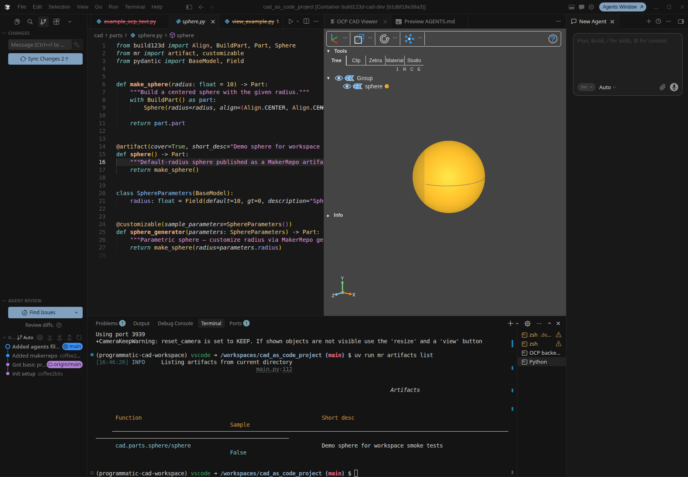

# CAD-as-Code, in a box

A turnkey workspace for **parametric CAD in Python**. Reopen this repo in any **VS Code-based IDE** with [Dev Containers](https://code.visualstudio.com/docs/devcontainers/containers) support — VS Code, Cursor, and compatible forks — and you get a complete modeling environment: IDE, live 3D viewer, automated tests, export tooling, and CI, already wired together.

Define geometry with [build123d](https://build123d.readthedocs.io/), preview it in the [OCP CAD Viewer](https://github.com/bernhard-42/vscode-ocp-cad-viewer), validate with pytest, and export to STEP, STL, and GLB. Publish artifacts through [MakerRepo](https://docs.makerrepo.com/makerrepo-library/) (`mr`). Python is the source of truth; mesh files are generated, not hand-edited.



## **What's in the box:**

| Layer | What you get |
|-------|--------------|
| **IDE** | Dev container (`.devcontainer/`) — VS Code, Cursor, or any compatible fork; dependencies sync on start |
| **Modeling** | build123d parts and assemblies under `cad/` |
| **Visualization** | OCP CAD Viewer + `ocp-vscode` bridge for `show_object` |
| **Quality** | pytest geometry tests, ruff, mypy |
| **Make** | [just](https://github.com/casey/just) command runner (`justfile`) for dev, export, and CI |
| **CI** | [Dagger](https://dagger.io/) — portable CI from local to GitHub Actions to any other pipeline tool; same checks everywhere |
| **Agents** | MCP servers for build123d execution and OCP Viewer screenshots |
| **Publish** | MakerRepo decorators and `mr` CLI for artifact discovery and export |

**AI agents:** see [AGENTS.md](AGENTS.md) for repo structure, parts/assemblies conventions, and MakerRepo usage.

## Stack

| Tool | Role |
|------|------|
| [build123d](https://github.com/gumyr/build123d) | Parametric CAD-as-code (Open CASCADE) |
| [OCP CAD Viewer](https://github.com/bernhard-42/vscode-ocp-cad-viewer) | Live 3D visualization in VS Code-based IDEs |
| [ocp-vscode](https://github.com/bernhard-42/ocp_vscode) | Python bridge for `show_object` |
| [uv](https://docs.astral.sh/uv/) | Dependency and virtualenv management |
| [just](https://github.com/casey/just) | Command runner for common dev, export, and CI tasks (`justfile`) |
| [pytest](https://docs.pytest.org/) | Geometry and export tests |
| [ruff](https://docs.astral.sh/ruff/) / [mypy](https://mypy-lang.org/) | Linting and type checking |
| [Dagger](https://dagger.io/) | Portable CI pipeline (local + GitHub Actions) |
| [build123d-mcp](https://github.com/pzfreo/build123d-mcp) | MCP tools for interactive CAD generation and inspection |
| [ocp-viewer-mcp](https://github.com/dmilad/ocp-viewer-mcp) | MCP screenshots from OCP CAD Viewer for agent vision |
| [MakerRepo](https://docs.makerrepo.com/makerrepo-library/) | Manufacturing-as-code decorators (`@artifact`, `@customizable`, `@cached`) |
| [makerrepo-cli](https://docs.makerrepo.com/makerrepo-cli/) | Local artifact discovery, export, and viewer integration (`mr`) |

## Quick start

1. Open this repo in **VS Code**, **Cursor**, or another VS Code-based IDE with Dev Containers support, then choose **Reopen in Container** (uses `.devcontainer/`).
2. Dependencies sync automatically on container start (`postStartCommand`). Run manually if needed:

   ```bash
   just sync
   ```

3. Run tests:

   ```bash
   just test
   ```

   Or directly: `uv run pytest`

4. View the sphere in the OCP CAD Viewer:

   ```bash
   just view
   ```

   Or directly: `uv run python main.py`

5. Export the sphere (MakerRepo CLI — preferred for published artifacts):

   ```bash
   just mr-artifacts
   just mr-export sphere /tmp/out step
   just mr-export-generator sphere_generator /tmp/out '{"radius": 15}'
   ```

   For ad-hoc exports in tests or scripts, use `cad_tooling.export.export_part(make_sphere(), "sphere", tmp_path)` — see [`tests/test_exports.py`](tests/test_exports.py).

6. *(Cursor)* Reload MCP servers (**Settings → MCP**) — [`.cursor/mcp.json`](.cursor/mcp.json) is committed and ready to use. See [MCP servers](#mcp-servers).

### OCP CAD Viewer extension

The VSIX is **not committed** — it is downloaded to the workspace root as `ocp-cad-viewer-3.4.0.vsix` (gitignored).

**Cursor-specific note:** v3.4.0 ships an ESM-only `proper-lockfile` dependency that crashes on activation in Cursor's extension host (`ERR_REQUIRE_ESM`). The devcontainer scripts patch the VSIX before install. VS Code is unaffected.

Setup:

1. **Download + patch (container lifecycle):** `onCreateCommand` / `postCreateCommand` run `.devcontainer/install-ocp-cad-viewer.sh download`.
2. **Install patched VSIX (after attach):** `postStartCommand` runs `.devcontainer/install-ocp-cad-viewer.sh install-cli` via the editor remote CLI (`code` or `cursor`).

If commands are still missing after reopening the container:

1. Run `bash .devcontainer/install-ocp-cad-viewer.sh install-cli` from a connected terminal.
2. **Developer: Reload Window** in your editor (required after reinstall).
3. Open the OCP CAD Viewer panel (activity bar icon), then run `uv run python main.py`.

## Project layout

```text
.
├── AGENTS.md                     # Agent conventions (parts, assemblies, MakerRepo)
├── LICENSE
├── .cursor/
│   ├── mcp.json                  # MCP server config for Cursor (committed)
│   ├── run-build123d-mcp.sh
│   └── run-ocp-viewer-mcp.sh
├── .makerrepo/
│   └── config.yaml               # MakerRepo repo config (export defaults, pythonpaths)
├── .github/
│   └── workflows/
│       └── ci.yml                # Dagger CI on push/PR
├── ci/
│   ├── dagger.json               # Dagger module config
│   ├── pyproject.toml
│   └── src/ci/main.py            # test, lint, check functions
├── .devcontainer/
│   ├── devcontainer.json
│   ├── Dockerfile
│   └── install-ocp-cad-viewer.sh
├── cad/
│   ├── parts/                    # Reusable parametric parts (@artifact, @customizable)
│   └── assemblies/               # Composed models
├── cad_tooling/                  # Export, render, release helpers (see cad_tooling/README.md)
├── justfile                      # Common dev, export, and CI commands (`just --list`)
├── main.py                       # Entry point — builds and displays a sphere
├── tests/                        # CAD model and integration tests
├── cad_tooling_tests/            # Unit tests for cad_tooling
└── pyproject.toml
```

## Development workflow

### Make commands (`just`)

[just](https://github.com/casey/just) wraps the most common repo tasks. It is preinstalled in the devcontainer; run `just` or `just --list` from the repo root to see all recipes.

| Group | Command | What it runs |
|-------|---------|--------------|
| **setup** | `just sync` | `uv sync` |
| | `just sync-frozen` | `uv sync --group dev --frozen` (matches CI) |
| **dev** | `just view` | Display `main.py` in OCP CAD Viewer |
| | `just test` | `uv run pytest` (pass extra args: `just test -v tests/test_sphere.py`) |
| **quality** | `just lint` | ruff check + format check + mypy |
| | `just format` | `uv run ruff format .` |
| | `just quality` | lint + test (local gate before pushing) |
| **makerrepo** | `just mr-artifacts` | List `@artifact` functions |
| | `just mr-generators` | List `@customizable` functions |
| | `just mr-export sphere /tmp/out step` | Export one artifact |
| | `just mr-view sphere` | Send artifact to OCP CAD Viewer |
| | `just mr-snapshot sphere` | Headless artifact PNG via `mr` |
| | `just mr-export-generator sphere_generator /tmp/out '{"radius": 15}'` | Export with parameters |
| **export** | `just export-smoke` | Discover and export all artifacts (CI smoke) |
| | `just export dist/export step sphere` | Export via `cad_tooling.export` |
| | `just release dist/` | STL + PNG release bundle |
| | `just release-notes OWNER/REPO v0.0.1` | Generate `dist/RELEASE_BODY.md` |
| | `just render dist/sphere.stl dist/sphere.png --camera top` | Headless PNG from STL |
| **release** | `just version-bump` | Bump `pyproject.toml` patch version via `uv version --bump` |
| | `just version-bump minor` | Bump minor (also accepts `major`, `alpha`, `beta`, `rc`, …) |
| | `just version-tag` | Create and push git tag `v{version}` from the current package version |
| **ci** | `just ci` | Full Dagger pipeline (lint + artifacts + test) |
| | `just ci-test` | Dagger pytest only |
| | `just ci-lint` | Dagger ruff + mypy only |
| | `just ci-artifacts` | Dagger artifact smoke export |
| | `just ci-release dist/` | Dagger release STL + PNG export to `dist/` |


### Modeling conventions

- **Source of truth:** Python model code — not STL meshes.
- **Parts** live in `cad/parts/`; **assemblies** in `cad/assemblies/`.
- Expose dimensions as function parameters with sensible defaults.
- Return `Part` or `Compound` from builder functions.
- Mark publishable models with MakerRepo decorators (see [MakerRepo](#makerrepo)).
- Test key dimensions, validity, and export behavior for each reusable part.
- Keep generated exports out of version control unless explicitly versioned under `tests/fixtures/`.

### Export formats

| Format | Use |
|--------|-----|
| STEP | CAD interchange (preferred for serious handoff) |
| STL / 3MF | 3D printing and manufacturing meshes |
| GLB / glTF | Lightweight preview and web |
| SVG / DXF | 2D profiles, laser cutting, documentation |

Initial implementation covers STEP, STL, and GLB. Additional formats will be added when a concrete model needs them.

### Testing

```bash
uv run pytest          # geometry and export tests
uv run pytest -v       # verbose output
```

Coverage includes validity, bounding boxes, volume checks, and STEP round-trip export.

### Quality checks (local)

```bash
just quality          # lint + pytest
just lint             # ruff + mypy only
just format           # apply ruff formatting
```

Or run the same checks individually:

```bash
uv run ruff check .
uv run ruff format --check .
uv run mypy cad cad_tooling tests cad_tooling_tests
uv run pytest
```

Or run the same pipeline as CI (requires Docker on the host and a devcontainer rebuild so the socket is mounted):

```bash
just ci               # full gate
just ci-test          # pytest only
just ci-lint          # ruff + mypy only
just ci-artifacts     # cad_tooling.export smoke
just ci-release dist/ # release STL + PNG to dist/
```

Equivalent Dagger invocations:

```bash
dagger call -m ./ci check --source=.
dagger call -m ./ci test --source=.       # pytest only
dagger call -m ./ci lint --source=.       # ruff + mypy only
dagger call -m ./ci artifacts --source=.  # cad_tooling.export smoke
dagger call -m ./ci release-artifact --source=. export --path=./dist
```

The Dagger module builds the `.devcontainer/Dockerfile` image, runs `uv sync --group dev`, then executes checks inside that environment — matching GitHub Actions.

## MakerRepo

[MakerRepo](https://docs.makerrepo.com/makerrepo-library/) adds Manufacturing-as-Code metadata to build123d functions. Decorators are **non-intrusive** — they do not change how your builders run; they only annotate functions so [makerrepo-cli](https://docs.makerrepo.com/makerrepo-cli/) (or MakerRepo.com CI) can discover, build, and export them.

Import decorators from `mr` (not `makerrepo`):

```python
from mr import artifact, customizable, cached
```

### MakerRepo annotations

| Annotation | Applies to | Purpose |
|------------|------------|---------|
| `@artifact` | Fixed publishable models | Registers a default-configuration part or assembly for discovery, export, and release. Use `short_desc=` for human-readable listings; `cover=True` marks the repo thumbnail (at most one). |
| `@customizable` | Parametric generators | Registers a function with a single Pydantic parameter model so users can vary dimensions via `mr generators export … -p '{…}'`. Requires `sample_parameters=` with valid defaults. |
| `@cached` | Expensive sub-builds | Caches repeated builds with the same arguments. Use on helpers that are costly to rebuild, not on simple geometry. |

`@artifact` and `@customizable` sit on entry points in `cad/parts/` or `cad/assemblies/` — not on bare `make_*` builders and not in `main.py`. See [AGENTS.md](AGENTS.md) for the three-layer pattern (`make_*` → `@artifact` / `@customizable`).

### Custom tooling: `@render`

[`@render`](cad_tooling/README.md#render-decorator) is **workspace custom tooling**, not a MakerRepo annotation. It lives in `cad_tooling` and exists to support `@artifact` release workflows: each published model can declare camera, colors, and PNG size for GitHub Release previews and `cad_tooling.export release`.

Place `@render` directly below `@artifact` on the same function:

```python
from cad_tooling.render_decorator import render
from mr import artifact

@artifact(short_desc="Demo sphere")
@render(camera="iso", face_color=(0.31, 0.63, 1.0))
def sphere() -> Part:
    return make_sphere()
```

MakerRepo discovery ignores `@render`; release export reads it when generating matching STL and PNG assets. Full preset list, CLI overrides, and resolution order: [CAD tooling — `@render`](cad_tooling/README.md#render-decorator).

### Example (sphere part)

```python
from build123d import Align, BuildPart, Part, Sphere
from cad_tooling.render_decorator import render
from mr import artifact, customizable
from pydantic import BaseModel, Field

def make_sphere(radius: float = 10) -> Part:
    with BuildPart() as part:
        Sphere(radius=radius, align=(Align.CENTER, Align.CENTER, Align.CENTER))
    return part.part

@artifact(cover=True, short_desc="Demo sphere for workspace smoke tests")
@render(camera="iso", face_color=(0.31, 0.63, 1.0))
def sphere() -> Part:
    return make_sphere()

class SphereParameters(BaseModel):
    radius: float = Field(default=10, gt=0)

@customizable(sample_parameters=SphereParameters())
def sphere_generator(parameters: SphereParameters) -> Part:
    return make_sphere(radius=parameters.radius)
```

See [`cad/parts/sphere.py`](cad/parts/sphere.py) for the live implementation.

### Repository config

[`.makerrepo/config.yaml`](.makerrepo/config.yaml) holds repo-level defaults (e.g. whether artifacts export STEP or 3MF when the decorator omits those flags). Optional `pythonpaths` entries prepend paths to `sys.path` before discovery — useful for `src/` layouts.

### CLI commands

Run from the repo root (included in dev dependencies):

```bash
uv run mr artifacts list                          # discover @artifact functions
uv run mr artifacts export sphere -o /tmp/out     # export STEP/STL/glTF/3MF/…
uv run mr artifacts view sphere                   # send to OCP CAD Viewer
uv run mr generators list                         # discover @customizable functions
uv run mr generators export sphere_generator -o /tmp/out -p '{"radius": 15}'
```

For full command reference, see the [MakerRepo CLI docs](https://docs.makerrepo.com/makerrepo-cli/).

### MakerRepo.com (optional)

To publish artifacts on [MakerRepo.com](https://makerrepo.com), create a repository there, push this code, and the platform CI will build `@artifact` and `@customizable` functions automatically. Local workflow with `mr` remains fully usable without an account.

## MCP servers

Two MCP servers are configured for agent-assisted CAD. [`.cursor/mcp.json`](.cursor/mcp.json) is committed for **Cursor**; launcher scripts resolve paths relative to the workspace so they work inside the devcontainer. Other editors may need equivalent MCP configuration.

In Cursor, reload MCP servers (**Settings → MCP**) after container rebuilds.

### Configured servers

| Server | Package | Pin | Role |
|--------|---------|-----|------|
| [build123d-mcp](https://github.com/pzfreo/build123d-mcp) | `build123d-mcp` | `0.3.36` | Run build123d code in a sandboxed session; measure, render, export, compare geometry |
| [ocp-viewer-mcp](https://github.com/dmilad/ocp-viewer-mcp) | `ocp-viewer-mcp` | `0.1.0` | Capture screenshots from OCP CAD Viewer so agents can see displayed models |

**build123d-mcp** runs in an isolated `uv tool` environment (Python 3.12 required for VTK/OCP wheels). Key tools: `execute`, `measure`, `render_view`, `export`, `session_state`.

**ocp-viewer-mcp** runs in this project's `.venv` (installed via `uv sync` dev dependencies). Requires the OCP CAD Viewer extension and a model displayed via `show_object()`.

### Workspace MCP config

```json
{
  "mcpServers": {
    "build123d-mcp": {
      "command": "bash",
      "args": [".cursor/run-build123d-mcp.sh"]
    },
    "ocp-viewer": {
      "command": "bash",
      "args": [".cursor/run-ocp-viewer-mcp.sh"]
    }
  }
}
```

Launcher scripts pin `build123d-mcp==0.3.36` (Python 3.12 via `uv tool run`) and run `ocp-viewer-mcp` from the project `.venv`. To bump versions, edit the launcher scripts and reload MCP.

### Typical agent workflow

1. Use **build123d-mcp** `execute` to prototype geometry incrementally; verify with `measure` and `render_view`.
2. Move stable parts into `cad/parts/` as normal Python modules with pytest coverage.
3. Run `uv run python main.py` and display in OCP CAD Viewer.
4. Use **ocp-viewer-mcp** `capture_ocp_screenshot` to let the agent visually confirm the viewer output.

### Troubleshooting

| Issue | Fix |
|-------|-----|
| build123d-mcp won't start | Ensure `uv` is on PATH; first launch downloads Python 3.12 + deps (network required) |
| ocp-viewer connection failed | Run `bash .devcontainer/install-ocp-cad-viewer.sh install-cli`, then **Developer: Reload Window**. Open OCP CAD Viewer panel before running `show_object()` scripts |
| MCP tools missing after container rebuild | Run `uv sync`; in Cursor, reload MCP (**Settings → MCP**) |

### Other MCP candidates (not configured and not an endorsement)

| Repository | Description |
|------------|-------------|
| [brs077/3dp-mcp-server](https://github.com/brs077/3dp-mcp-server) | 3D-printable CAD with build123d (Bambu Lab X1C focus) |
| [jdilla1277/agentcad](https://github.com/jdilla1277/agentcad) | CAD CLI and MCP server for AI agents |
| [rishigundakaram/cadquery-mcp-server](https://github.com/rishigundakaram/cadquery-mcp-server) | CadQuery MCP server |
| [blwfish/freecad-mcp](https://github.com/blwfish/freecad-mcp) | FreeCAD MCP integration |

## Future work Roadmap

Order may shift based on project needs.

- Additional parts and real assemblies (constraints, patterns)
- Import [build123d part libraries](https://build123d.readthedocs.io/en/latest/external.html#part-libraries) (e.g. [bd_warehouse](https://bd-warehouse.readthedocs.io/), [bd_beams_and_bars](https://bd-beams-and-bars.3d.experimentslabs.com/), [py_gearworks](https://github.com/GarryBGoode/py_gearworks), [bd_vslot](https://bd-vslot.readthedocs.io))
- [PartCAD](https://partcad.org/) integration — import and publish packaged CAD models
- Bill of materials (BOM) generation from assemblies
- 3MF, SVG, and DXF export helpers where models need them
- Import helpers (STEP → build123d) with human/agent review workflow
- Export regression tests with golden STEP/STL fixtures under `tests/fixtures/`
- Printer-specific export profiles (e.g. Bambu) if `3dp-mcp-server` or similar is adopted
- Pre-commit hooks (optional ruff format/check on commit; pytest left to CI)
- [release-please](https://github.com/googleapis/release-please) for automated semver bumps, changelogs, and release PRs
- `pytest-cov` coverage threshold on `cad/` once the library grows
- CI demonstration of topology optimization (e.g. [dl4to4ocp](https://github.com/yeicor-3d/dl4to4ocp/))

### CI and automation

Pushes and pull requests to `main` run the Dagger pipeline when changes touch model code, tests, CI, dependencies, or agent docs — see path filters in [`.github/workflows/ci.yml`](.github/workflows/ci.yml).

| Function | What it runs |
|----------|--------------|
| `check` | lint + artifacts + test (used in GitHub Actions) |
| `test` | `uv run pytest` |
| `lint` | `uv run ruff check .`, `ruff format --check .`, `mypy cad cad_tooling tests cad_tooling_tests` |
| `artifacts` | `python -m cad_tooling.export smoke` (discover and export all artifacts as STEP + STL) |
| `release-artifact` | `python -m cad_tooling.export release` (STL + PNG previews; per-artifact `@render` settings) |

The pipeline builds from [`.devcontainer/Dockerfile`](.devcontainer/Dockerfile) for Open CASCADE / Mesa parity with local dev. OCP viewer VSIX and MCP servers are not part of CI.

### Release preview renders

Each artifact's release PNG is configured with [`@render`](cad_tooling/README.md#render-decorator) on the `@artifact` function. See [`cad/parts/sphere.py`](cad/parts/sphere.py) and [CAD tooling — `@render`](cad_tooling/README.md#render-decorator) for CLI commands, camera presets, and override behavior.

### Version management

The package version lives in [`pyproject.toml`](pyproject.toml) (`[project].version`). Release tags use the same semver with a `v` prefix (e.g. `0.0.1` → tag `v0.0.1`). Keep the two in sync — the release workflow expects them to match.

| Command | What it does |
|---------|--------------|
| `just version-bump` | Bump the patch version (`0.0.1` → `0.0.2`) via `uv version --bump` |
| `just version-bump minor` | Bump minor (`0.0.1` → `0.1.0`); also accepts `major`, `alpha`, `beta`, `rc`, and other `uv version --bump` kinds |
| `just version-tag` | Read the current version with `uv version --short`, create tag `v{version}`, and push it to `origin` |

Pass the bump kind as a positional argument (`just version-bump minor`), not as `name=value` — `just` treats `part=patch` as a literal string.

**Typical release flow** (from `main`, after CI is green):

```bash
just version-bump              # or: just version-bump minor
git add pyproject.toml uv.lock # commit if uv re-locked
git commit -m "Bump version to $(uv version --short)"
git push origin main
just version-tag               # creates and pushes v{version}
```

`just version-tag` fails if the tag already exists locally. To inspect the version without changing it: `uv version --short`.

### Releases

Pushing a semver tag (e.g. `v0.0.1`) runs [`.github/workflows/release.yml`](.github/workflows/release.yml):

1. **Quality gate** — same Dagger `check` as CI (lint, artifact smoke, pytest).
2. **Export** — all `@artifact` models as STL plus PNG preview renders via `cad_tooling.render` (Open CASCADE offscreen rendering; Xvfb in CI).
3. **GitHub Release** — attaches `dist/*.stl`, matching `dist/*.png` previews, and a generated release body listing each artifact with embedded preview images.

**Download assets:** open the tag on GitHub Releases. The release page lists every `@artifact` with an embedded preview image and download links for each STL and PNG.

**Local dry-run** (preview assets and release notes before tagging):

```bash
just release dist/
just release-notes YOUR_ORG/YOUR_REPO v0.0.1
```

Or directly:

```bash
uv run python -m cad_tooling.export release -o dist/
uv run python -m cad_tooling.export release-notes \
  --assets-dir dist \
  --repo YOUR_ORG/YOUR_REPO \
  --tag v0.0.1 \
  -o dist/RELEASE_BODY.md
```

**Release note URLs:** preview images and STL links in `RELEASE_BODY.md` use absolute GitHub Release asset URLs, not relative paths. GitHub does not resolve `sphere.png` or `./sphere.png` in a release body against attached assets — the body is not a repo file. Use the `releases/download` form so images render inline on the published release page:

```markdown


[sphere.stl](https://github.com/YOUR_ORG/YOUR_REPO/releases/download/v0.0.1/sphere.stl)
```

`release-notes` builds these from `--repo` and `--tag`. Local `dist/` paths are only for exporting files on disk; the workflow uploads those assets and the generated body references them by release URL. Images in `dist/RELEASE_BODY.md` will not preview locally until the tag is published with `dist/*.png` attached.

See [`.github/release_template.md`](.github/release_template.md) for the release notes format.

**Local Dagger** (inside the devcontainer after rebuild):

1. Host Docker must be running and `/var/run/docker.sock` mounted (configured in `devcontainer.json`).
2. Run from the repo root: `just ci` (or `dagger call -m ./ci check --source=.`)

## Known limitations

- build123d is code-first — not a full GUI CAD application.
- OCP CAD Viewer visualizes Python-defined geometry; the model source remains code.
- Selector-based operations (faces, edges) can break if topology changes unexpectedly.
- STEP is the reliable interchange format; STL is lossy.
- Rebuilding clean parametric code from imported STL usually requires human or agent interpretation.
- MCP servers in this space are experimental until vetted and pinned.
- VSIX extension install may require a manual step if the editor remote CLI (`code` / `cursor`) is unavailable in the container.

## Additional resources

- [CAD tooling](cad_tooling/README.md) — export helpers, headless OCP rendering, `@render`, release notes, and CI integration

## License

See [LICENSE](LICENSE).
