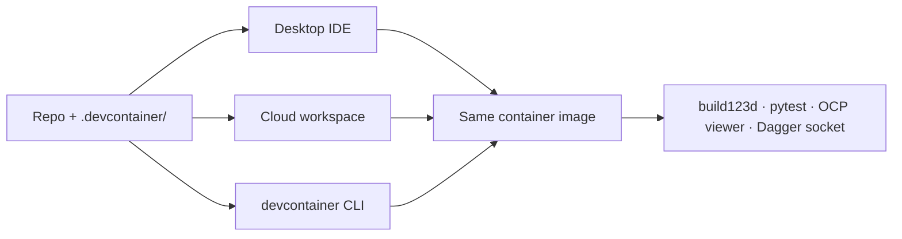

# IDEs and workspaces

This template is built around a single [`.devcontainer/`](https://github.com/Coffee2Bits/CAD-as-Code-Template/tree/main/.devcontainer) directory. Any editor or service that implements the [Development Container Specification](https://containers.dev/) reads the same `devcontainer.json`, runs the same lifecycle hooks, and lands in the same [Open CASCADE](/reference/open-cascade) environment as CI.

That is the portability story: **clone once, reopen in a container anywhere** — laptop, cloud VM, or a teammate's machine — and get build123d, pytest, ruff, the OCP CAD Viewer installer, and `just` recipes without hand-tuning a host OS.

## What every compatible host gets

Regardless of which client attaches, the container provides:

| Capability | Source |
|------------|--------|
| Open CASCADE / Mesa parity with CI | `.devcontainer/Dockerfile` |
| Python deps + dev tools | `postStartCommand` → `post-start.sh` → `uv sync` |
| Documentation site | `postStartCommand` → `post-start.sh` → `start-docs.sh` (port 3000, auto-forwarded) |
| OCP CAD Viewer VSIX download/install | `.devcontainer/install-ocp-cad-viewer.sh` |
| Ruff format-on-save settings | `customizations.vscode` in `devcontainer.json` |
| Local Dagger CI (`just ci`) | Docker socket mount + `docker-outside-of-docker` feature |
| Docs site tooling | Node 20 feature + `just docs-install` |
| MCP servers | `uv sync` + [`.cursor/mcp.json`](https://github.com/Coffee2Bits/CAD-as-Code-Template/blob/main/.cursor/mcp.json) launchers — run **inside** the container |

Editor UI for AI agents and MCP connection varies by client, but **model code, tests, exports, and MCP server binaries** all live in the container.

## Desktop editors (VS Code family)

These clients implement the [Dev Containers extension](https://marketplace.visualstudio.com/items?itemName=ms-vscode-remote.remote-containers) workflow: open the repo → **Reopen in Container** (or equivalent) → attach to the built image.

| Editor | Dev Containers | Typical entry | AI / agents |
|--------|----------------|---------------|-------------|
| [Visual Studio Code](https://code.visualstudio.com/) | Native (reference implementation) | Clone repo → **Dev Containers: Reopen in Container** | [GitHub Copilot](https://github.com/features/copilot), Copilot coding agent, third-party MCP |
| [GitHub Copilot in VS Code](https://marketplace.visualstudio.com/items?itemName=GitHub.copilot) | Same as VS Code — Copilot is an extension, not a separate IDE | Install Copilot → reopen in container | Inline chat, agent mode; import in-container MCP from [`.cursor/mcp.json`](/tools/mcp-servers) |
| [Cursor](https://cursor.com/) | Native (VS Code fork) | Clone repo → **Reopen in Container** | Built-in agent; [MCP in container](/tools/mcp-servers) via committed `.cursor/mcp.json` |
| [VSCodium](https://vscodium.com/) | Via open-vsx Remote Containers extension | Same flow as VS Code | Bring your own extensions (Copilot marketplace builds differ) |
| [Positron](https://positron.posit.co/) | VS Code–compatible remote containers | Reopen in Container | Positron assistant + R/Python focus |
| [Windsurf](https://windsurf.com/) | Partial — prefer attaching over SSH to a running container or [Codespace](https://github.com/features/codespaces) rather than one-click local reopen | Remote-SSH to cloud workspace, or community Codespaces bridges | Cascade AI; verify container workflow on your platform |

:::tip First-time container build
The initial image build can take several minutes (Open CASCADE system packages, `uv sync`, OCP VSIX download). Later starts are much faster.
:::

### Cursor-specific notes

- **MCP** — servers run in the dev container; `.cursor/mcp.json` connects automatically. Reload MCP after container rebuilds ([quick start](/getting-started/quick-start#mcp-servers)).
- **OCP CAD Viewer** — the devcontainer patches the VSIX for a Cursor extension-host ESM issue; VS Code is unaffected ([OCP viewer](/getting-started/ocp-viewer#cursor-esm-patch)).

## Cloud workspaces

Cloud hosts run the same `devcontainer.json` on a remote VM. You connect from a browser or a desktop client.

| Service | Role | How to use this template |
|---------|------|--------------------------|
| [GitHub Codespaces](https://github.com/features/codespaces) | Managed VS Code in the cloud | **Code** → **Create codespace on main**, or `gh codespace create` — reads `.devcontainer/` automatically |
| [vscode.dev](https://vscode.dev/) | Lightweight browser editor | Best for quick edits; full dev container + viewer workflow usually needs Codespaces or a desktop client |
| [GitHub Copilot coding agent](https://docs.github.com/en/copilot/concepts/agents/coding-agent) | Agent runs against the repo on GitHub | Works with the same repo layout; environment parity comes from Actions / containerized CI rather than your local UI |
| [Ona](https://www.ona.com/) (formerly Gitpod) | Spec-compliant cloud environments | Import repo; environment from `devcontainer.json` |
| [CodeSandbox](https://codesandbox.io/) | Cloud dev environments (Podman-backed) | Import GitHub repo; uses [dev container spec](https://containers.dev/supporting) with `.codesandbox/` task config |
| [DevPod](https://devpod.sh/) | Client for local, SSH, Kubernetes, or cloud backends | `devpod up <repo-url>` — provisions from `devcontainer.json` on your chosen provider |

:::info Codespaces and Docker
[GitHub Codespaces](https://containers.dev/supporting) allows the Docker socket bind mount used in this template, so `just ci` (Dagger) can work in a codespace when the host provides Docker. Other cloud hosts may restrict socket mounts — run CI via GitHub Actions if local Dagger is unavailable.
:::

### Connecting desktop VS Code or Cursor to Codespaces

You are not limited to the browser:

1. **VS Code** — install [GitHub Codespaces](https://marketplace.visualstudio.com/items?itemName=GitHub.codespaces) → sign in → open the codespace from the Remote Explorer.
2. **Cursor** — use Remote-SSH to the codespace, or a community extension such as [Cursor Codespaces](https://github.com/orbiktech/cursor-codespaces-extension) for GitHub CLI–driven connect.

The **container contents are identical** whether you use the web editor or a desktop client; only the UI shell changes.

## Other spec-compatible tools

The [containers.dev supporting tools](https://containers.dev/supporting) list grows over time. These also consume `devcontainer.json`:

| Tool | Notes for this repo |
|------|---------------------|
| [Dev Container CLI](https://github.com/devcontainers/cli) | `devcontainer up --workspace-folder .` — headless bring-up; used by CI and other services |
| [Visual Studio 2022](https://devblogs.microsoft.com/cppblog/dev-containers-for-c-in-visual-studio/) | C++ focused; Python CAD workflow is better suited to VS Code family clients |
| [IntelliJ IDEA](https://www.jetbrains.com/idea/) | Early dev container support via SSH/Docker — viable if your team standardizes on JetBrains |
| [DevPod](https://devpod.sh/) | Good when you want the same spec on a bare VM or Kubernetes without installing Docker Desktop locally |

## AI agents across workspaces

AI assistance is a **layer on top of** the dev container, not a replacement for it:

| Agent surface | Where it runs | MCP / viewer |
|---------------|---------------|--------------|
| Cursor agent | IDE UI + dev container | MCP servers run in container; [`.cursor/mcp.json`](/tools/mcp-servers) auto-wired |
| GitHub Copilot (VS Code / Codespaces) | Extension in the attached container UI | Import `.cursor/mcp.json` entries — launchers run in container ([VS Code MCP docs](https://code.visualstudio.com/docs/copilot/chat/mcp-servers)) |
| GitHub Copilot coding agent | GitHub-hosted against the repository | Uses repo + Actions; not tied to a local IDE |
| Claude / other MCP clients | Any client with MCP support | Same `.cursor/run-*.sh` launchers while attached to the dev container |

Source of truth remains Python under `cad/` — agents and MCP only help edit, execute, and verify geometry ([stack architecture](/#stack-architecture)).

## Choosing a setup

| You want… | Start here |
|-----------|------------|
| Lowest friction, full extensions | **VS Code** or **Cursor** + local Docker → [Quick start](/getting-started/quick-start) |
| No local Docker install | **GitHub Codespaces** on this template repo |
| Copilot as primary assistant | **VS Code** or **Codespaces** with Copilot extension |
| Cursor agent + in-container MCP | **Cursor** + [MCP servers](/tools/mcp-servers) |
| Same spec on a remote VM | **DevPod** or **Ona** |
| Maximum extension marketplace | **VS Code** (Microsoft marketplace) |

## Portable checklist

After switching IDEs or moving local → cloud:

1. **Reopen in Container** (or rebuild the codespace) so lifecycle hooks run.
2. Run `just sync` if dependencies look stale.
3. Run `just test` and `just view` to confirm geometry + viewer.
4. Reload MCP in the IDE after a container rebuild (servers are already in the container).
5. For Dagger locally: confirm Docker is reachable (`just ci`).

## Related docs

- [Quick start](/getting-started/quick-start) — first run in a container
- [Dev container](/getting-started/dev-container) — lifecycle hooks, Docker socket, editor settings
- [OCP CAD Viewer](/getting-started/ocp-viewer) — viewer install and IDE quirks
- [MCP servers](/tools/mcp-servers) — agent tools alongside the IDE
