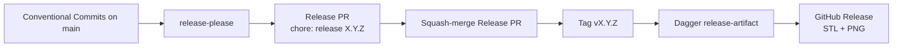

# Releases

This template ships **automated GitHub Releases**: STL and PNG assets for every `@artifact`, plus a generated release body. The flow is driven by [release-please](https://github.com/googleapis/release-please) and [Conventional Commits](https://www.conventionalcommits.org/) on `main`.

**Prerequisites:** create and initialize your repo first, then complete [Set up GitHub for your repository](/getting-started/github-setup). Workflow permissions and squash merge are required before release-please can open Release PRs or publish assets.

## How it works



| Step | What happens |
|------|----------------|
| 1 | You merge feature/fix PRs to `main` with **squash** titles like `feat(sphere): add label` |
| 2 | [`release-please.yml`](https://github.com/Coffee2Bits/CAD-as-Code-Template/blob/main/.github/workflows/release-please.yml) opens or updates a **Release PR** (`chore: release 0.2.0`) |
| 3 | You review the Release PR (version bump in `pyproject.toml`, `CHANGELOG.md`) and merge it |
| 4 | The squash subject `chore: release X.Y.Z` triggers export + [`cad_tooling`](/tools/cad-tooling/) release notes + GitHub Release upload |

Version tracking: [`release-please-config.json`](https://github.com/Coffee2Bits/CAD-as-Code-Template/blob/main/release-please-config.json) and [`.release-please-manifest.json`](https://github.com/Coffee2Bits/CAD-as-Code-Template/blob/main/.release-please-manifest.json) (reset to `0.0.0` by `just init`).

## First release on a new repository

After [creating and initializing your repo](/getting-started/template-and-init) and completing [GitHub setup](/getting-started/github-setup):

1. **Confirm Actions settings** — Settings → Actions → General: **Read and write permissions** and **Allow GitHub Actions to create and approve pull requests** (see [workflow permissions](/getting-started/github-setup#actions-workflow-permissions)).
2. **Merge a releasable change** — open a PR with a Conventional Commit squash title, e.g. `feat: initial customization`, and merge to `main`.
3. **Wait for release-please** — within a few minutes, a Release PR should appear (title `chore: release 0.2.0` or similar). If it does not, see [Release troubleshooting](/troubleshooting/release-please).
4. **Merge the Release PR** — use the default squash title (`chore: release X.Y.Z`); do not edit it.
5. **Verify the GitHub Release** — Repository → **Releases** → new tag `vX.Y.Z` with `dist/*.stl`, `dist/*.png`, and generated notes.

You do not need repository secrets — workflows use `GITHUB_TOKEN`.

## Day-to-day versioning

| Squash PR title prefix | Release impact |
|------------------------|----------------|
| `feat:` | Minor semver bump |
| `fix:` | Patch bump |
| `feat!:` / `fix!:` / `BREAKING-CHANGE:` footer | Major bump |
| `docs:`, `deps:` | Releasable (Python release-type) |
| `chore:`, `ci:`, `test:` | No changelog entry on their own |

The **PR title** becomes the squash commit subject on `main` — that is what release-please parses. Full commit guide: [Releases workflow](/workflows/releases#conventional-commits-summary) and [AGENTS.md](https://github.com/Coffee2Bits/CAD-as-Code-Template/blob/main/AGENTS.md#commit-messages-release-please).

## What gets published

**Release PR merge** (`release-please.yml`):

1. **Tag + GitHub Release** — release-please creates the tag and changelog body
2. **Export** — `release-assets.yml` exports `@artifact` models with `@render` as STL + PNG
3. **Upload** — assets attached; artifact notes appended via [`cad_tooling.export release-notes`](/tools/cad-tooling/release-notes)

**Manual tag push or `workflow_dispatch` repair** (`release.yml`):

1. **Quality gate** — Dagger `check` (ruff, mypy, vulture, artifact export verification, pytest)
2. **Export** — `@artifact` models that declare `@render` as STL + PNG
3. **GitHub Release** — assets attached; body from [`cad_tooling.export release-notes`](/tools/cad-tooling/release-notes)

Release notes template: [`.github/release_template.md`](https://github.com/Coffee2Bits/CAD-as-Code-Template/blob/main/.github/release_template.md).

## Local dry-run

`just release-notes` reads `owner/repo` from [`template.repo.toml`](https://github.com/Coffee2Bits/CAD-as-Code-Template/blob/main/template.repo.toml) — set that file first (see [Replace the template identity](/getting-started/template-and-init#replace-the-template-identity)).

```bash
just export
just release-notes v0.1.0
```

Override the repo slug explicitly: `just release-notes v0.1.0 repo=USERNAME/my-widget`

Inspect `dist/` for STL/PNG and `dist/RELEASE_BODY.md` before trusting CI/CD pipeline output.

## Manual tag fallback

If you need a release without a Release PR:

```bash
just version-bump        # optional — bumps pyproject.toml locally
just version-tag         # creates and pushes v{version}
```

Pushing a **strict semver** tag (`v1.2.3` only — no suffixes) runs [`release.yml`](https://github.com/Coffee2Bits/CAD-as-Code-Template/blob/main/.github/workflows/release.yml). Prefer the release-please path for changelog discipline.

### Single publish path

| Step | Workflow | What it does |
|------|----------|--------------|
| Day-to-day merges | `release-please.yml` | Opens/updates Release PRs |
| Merge Release PR | `release-please.yml` | Creates git tag, GitHub Release, exports STL/PNG, uploads assets |
| Tag push `vX.Y.Z` | `release.yml` | Manual fallback: quality gate → export STL/PNG → upload assets |
| Repair missing assets | `release.yml` → **Run workflow** | `workflow_dispatch` with tag name (for example `v0.3.0`) |

Do **not** run `gh release create` for normal releases — that bypasses export and can duplicate tags. Use `gh release list` / `gh release view` to inspect only.

## GitHub CLI

The dev container ships [`gh`](https://cli.github.com/) — see [Dev container → GitHub CLI](/getting-started/dev-container#github-cli) for authentication:

```bash
gh release list --repo OWNER/REPO
gh release view v0.1.0 --repo OWNER/REPO
```

## Fork vs your own repo

| Scenario | Release automation |
|----------|-------------------|
| **Use this template** → new repository | Follow this page and [GitHub setup](/getting-started/github-setup) |
| **Fork** to contribute upstream | Usually **disable or ignore** release-please on your fork; open PRs to the upstream repo instead |
| **Fork** as a starting point for a separate product | Treat like a template: rename/customize, then configure GitHub settings on **your** fork |

## Troubleshooting

See **[Release Please & GitHub Releases troubleshooting](/troubleshooting/release-please)** for symptom-by-symptom fixes (missing STL/PNG assets, stale `autorelease` labels, untagged merges, workflow parse errors, and repair via `workflow_dispatch`).

Quick checks:

| Symptom | First step |
|---------|------------|
| No Release PR | [Workflow permissions](/getting-started/github-setup#actions-workflow-permissions) |
| Release without assets | **Release** workflow → `workflow_dispatch` with tag `vX.Y.Z` |
| Export fails in CI | `just export-smoke` locally → [Export troubleshooting](/troubleshooting/export-and-ci) |

More detail: [Releases workflow](/workflows/releases) · [GitHub setup](/getting-started/github-setup#troubleshooting).
