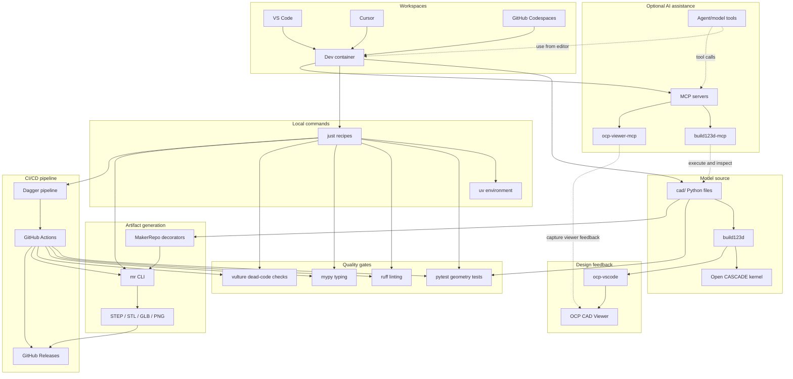

# CAD-as-Code, in a box

A turnkey workspace for [parametric CAD as software](/reference/glossary#cad-as-code). Reopen this repo in any Dev Containers-capable editor or cloud workspace — [VS Code](https://code.visualstudio.com/), [Cursor](https://cursor.com/), [GitHub Codespaces](https://github.com/features/codespaces), and [many other clients](/getting-started/ide-and-workspaces) — and you get a complete modeling environment: IDE, live 3D viewer, automated tests, export tooling, and a CI/CD pipeline already wired together.

Define geometry with [build123d](https://build123d.readthedocs.io/), preview it in the [OCP CAD Viewer](https://github.com/bernhard-42/vscode-ocp-cad-viewer), validate it with pytest and quality checks, then export STEP, STL, GLB, and release assets from the same source. Python in `cad/` is the [source of truth](/reference/glossary#source-of-truth); generated files are outputs, not files you hand-manage.

If you are new to software-style workflows, that is the point of the template: the non-CAD pieces are all here and configured so your CAD work is repeatable, inspectable, and automated so that you can focus on design and modeling. If a term is unfamiliar, start with the [glossary](/reference/glossary) and follow the linked guide from there.

<small><em>The default workspace: source code, live model preview, and agent assistance sharing the same containerized CAD environment.</em></small>

<small><em>A section cut through the demo sphere assembly, showing the kind of interior geometry the OCP CAD Viewer can inspect while you iterate.</em></small>

## What's in the box

| Layer | What you get |
|-------|--------------|
| IDE | Dev container (`.devcontainer/`) for [VS Code, Cursor, Codespaces, and more](/getting-started/ide-and-workspaces); dependencies and docs site start with the workspace |
| Modeling | build123d parts and assemblies under `cad/` |
| Visualization | OCP CAD Viewer plus the `ocp-vscode` bridge for `show_object` |
| Quality | [ruff linting, mypy type checks, and vulture dead-code detection](/tools/uv-and-quality) |
| Commands | [just](/tools/just) command runner for development, export, and CI/CD pipeline tasks |
| CI/CD pipeline | [Dagger](/workflows/ci-and-dagger) plus GitHub Actions for repeatable checks and releases |
| Agents | Optional AI assistance from tools such as Cursor, Claude, and GitHub Copilot |
| MCP | Agent tools in the dev container: [build123d-mcp](/tools/mcp-servers) and [ocp-viewer-mcp](/tools/mcp-servers) |
| Publish | [MakerRepo](/tools/makerrepo) decorators and `mr` CLI for artifact discovery and export |

## Stack architecture

The source of truth is always Python model code in `cad/`. Editors and AI tools work around that source, while commands, quality checks, export tools, and the CI/CD pipeline all regenerate results from it. That keeps changes reviewable: the model code changes first, and artifacts follow from repeatable automation.

## Stack

| Tool | Role |
|------|------|
| [build123d](https://github.com/gumyr/build123d) | Parametric CAD-as-Code on [Open CASCADE](/reference/open-cascade) |
| [OCP CAD Viewer](https://github.com/bernhard-42/vscode-ocp-cad-viewer) | Live 3D visualization in VS Code-based IDEs |
| [ocp-vscode](https://github.com/bernhard-42/ocp_vscode) | Python bridge for `show_object` |
| [uv](https://docs.astral.sh/uv/) | Dependency and virtualenv management |
| [just](https://github.com/casey/just) | Command runner for development, export, and CI/CD pipeline tasks |
| [pytest](https://docs.pytest.org/) | Geometry and export tests |
| [ruff](https://docs.astral.sh/ruff/) / [mypy](https://mypy-lang.org/) / [vulture](https://github.com/jendrikseipp/vulture) | Linting, type checking, and dead-code detection |
| [Dagger](https://dagger.io/) | Portable CI/CD pipeline from local runs to GitHub Actions |
| [build123d-mcp](https://github.com/pzfreo/build123d-mcp) | MCP interface for sandboxed geometry execution by agents |
| [ocp-viewer-mcp](https://github.com/dmilad/ocp-viewer-mcp) | MCP interface for viewer screenshots and visual feedback |
| [MakerRepo](https://docs.makerrepo.com/makerrepo-library/) | `@artifact`, `@customizable`, and `@cached` decorators |
| [makerrepo-cli](https://docs.makerrepo.com/makerrepo-cli/) | Artifact discovery, export, and viewer integration |

## New repo from the template?

If you used [Use this template](https://github.com/Coffee2Bits/CAD-as-Code-Template/generate):

1. Follow [Create and initialize your repository](/getting-started/template-and-init): Use this template, edit `template.repo.toml`, then run `just init`.
2. Complete [Set up GitHub](/getting-started/github-setup) for Actions, Pages, branch protection, and merge settings.
3. Read [Releases](/getting-started/releases) before publishing generated assets.

Details: [Replace the template identity](/getting-started/template-and-init#replace-the-template-identity).

## Explore the docs

| Area | Start here |
|------|------------|
| Getting started | [Quick start](/getting-started/quick-start) · [Create and initialize](/getting-started/template-and-init) · [GitHub setup](/getting-started/github-setup) · [Releases](/getting-started/releases) · [Project layout](/getting-started/project-layout) · [IDEs and workspaces](/getting-started/ide-and-workspaces) |
| Modeling | [Conventions](/modeling/conventions) · [Parts and assemblies](/modeling/parts-and-assemblies) · [Testing strategy](/modeling/testing) · [External libraries](/modeling/external-libraries) |
| Tools | [just](/tools/just) · [uv and quality](/tools/uv-and-quality) · [MakerRepo](/tools/makerrepo) · [MCP servers](/tools/mcp-servers) · [CAD tooling](/tools/cad-tooling/) |
| Workflows | [Daily development](/workflows/daily-development) · [Export and formats](/workflows/export-and-formats) · [CI/CD pipeline and Dagger](/workflows/ci-and-dagger) · [Releases](/workflows/releases) |
| Reference and help | [Glossary](/reference/glossary) · [Troubleshooting](/troubleshooting/) · [Open CASCADE](/reference/open-cascade) · [For agents](/contributing/for-agents) |

## Roadmap

- Additional parts and real assemblies: constraints, patterns, and reusable project structure.
- [build123d part libraries](/modeling/external-libraries) and [PartCAD](https://partcad.org/) integration.
- Bills of materials from assemblies.
- Manufacturing export profiles that let one model target different processes: printer-specific margins for Bambu or Prusa workflows, tighter CNC machining clearances, and reusable shop defaults for generated release artifacts.
- Topology optimization demos, for example [dl4to4ocp](https://github.com/yeicor-3d/dl4to4ocp/).

## Repository

[Coffee2Bits/CAD-as-Code-Template](https://github.com/Coffee2Bits/CAD-as-Code-Template)
