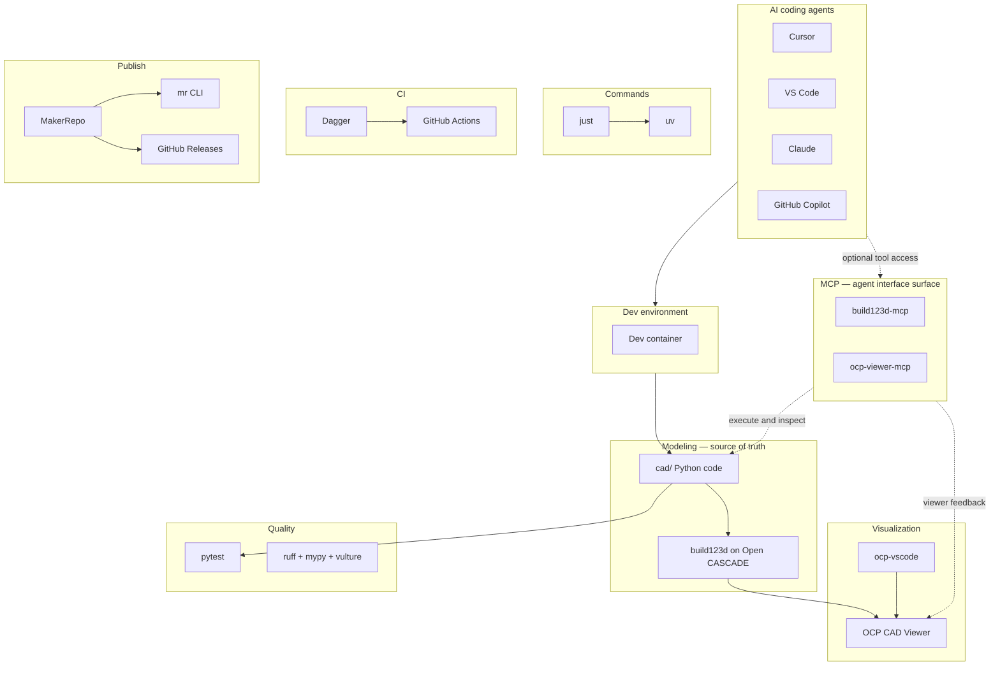

# CAD-as-Code, in a box

This template is a complete starting point for parametric CAD as software. The model is Python source code. The generated files are outputs. The workflow around the model uses the same tools software teams use to make work repeatable: source control, tests, linting, CI, releases, and documentation.

If that sounds like a lot for CAD, here is the reason: the extra pieces make models easier to review, regenerate, automate, and hand off. A bracket, enclosure, jig, or assembly can be changed by editing a parameter, tested before release, exported in known formats, and published from the same source every time.

## The idea

CAD-as-Code does not mean "write code because code is fashionable." It means the design intent lives in plain source files:

- Dimensions and relationships are named values, not hidden clicks.
- Reusable parts live under `cad/parts/`.
- Assemblies compose those parts under `cad/assemblies/`.
- Tests check that important geometry still exists and exports still work.
- CI reruns the checks when the repo changes.
- Release workflows regenerate manufacturing artifacts from source.

That is why this template includes tools that may not look like CAD at first: `just`, `uv`, pytest, ruff, mypy, Dagger, GitHub Actions, MakerRepo, and MCP launchers. They form the software layer around the CAD model.

## Stack architecture

The source of truth is always Python model code in `cad/`. AI agents and MCP servers can help inspect, execute, and view the model, but they do not replace the files under version control.

## Read by intent

Start shallow, then go deeper as needed.

### I want to try it

- [Quick start](/getting-started/quick-start) — open the container and run the demo.
- [IDEs and workspaces](/getting-started/ide-and-workspaces) — choose VS Code, Cursor, Codespaces, or another client.
- [OCP CAD Viewer](/getting-started/ocp-viewer) — see the model while you work.

### I want to understand the repo

- [Project layout](/getting-started/project-layout) — what each directory is for.
- [Modeling conventions](/modeling/conventions) — rules for source-of-truth CAD code.
- [Parts and assemblies](/modeling/parts-and-assemblies) — how reusable parts become composed models.
- [Open CASCADE](/reference/open-cascade) — the geometry kernel under build123d.

### I want to build and ship models

- [Daily development](/workflows/daily-development) — edit, view, test, repeat.
- [Testing](/modeling/testing) — write checks for geometry and exports.
- [Export and formats](/workflows/export-and-formats) — generate STEP, STL, GLB, and bundles.
- [Releases](/workflows/releases) — publish versioned assets.

### I want to use the automation layer

- [just commands](/tools/just) — the common command surface.
- [uv and quality](/tools/uv-and-quality) — dependencies, formatting, linting, typing, and dead-code checks.
- [CI and Dagger](/workflows/ci-and-dagger) — run the pipeline locally or in GitHub Actions.
- [MakerRepo](/tools/makerrepo) — discover and export CAD artifacts.
- [MCP servers](/tools/mcp-servers) — give agents controlled access to geometry and viewer feedback.

### I am stuck

- [Troubleshooting](/troubleshooting/) — route by symptom.
- [Dev Container troubleshooting](/troubleshooting/dev-container) — container and dependency problems.
- [OCP Viewer troubleshooting](/troubleshooting/ocp-viewer) — viewer setup and display problems.
- [Export and CI troubleshooting](/troubleshooting/export-and-ci) — artifact, lint, release, and pipeline issues.

## New repo from the template?

If you used [Use this template](https://github.com/Coffee2Bits/CAD-as-Code-Template/generate):

1. Edit [`template.repo.toml`](https://github.com/Coffee2Bits/CAD-as-Code-Template/blob/main/template.repo.toml), then run `just init`.
2. Complete [Set up GitHub](/getting-started/github-setup) for Actions, Pages, branch protection, and release settings.
3. Read [Releases](/getting-started/releases) before publishing generated assets.

## Repository

[Coffee2Bits/CAD-as-Code-Template](https://github.com/Coffee2Bits/CAD-as-Code-Template)
