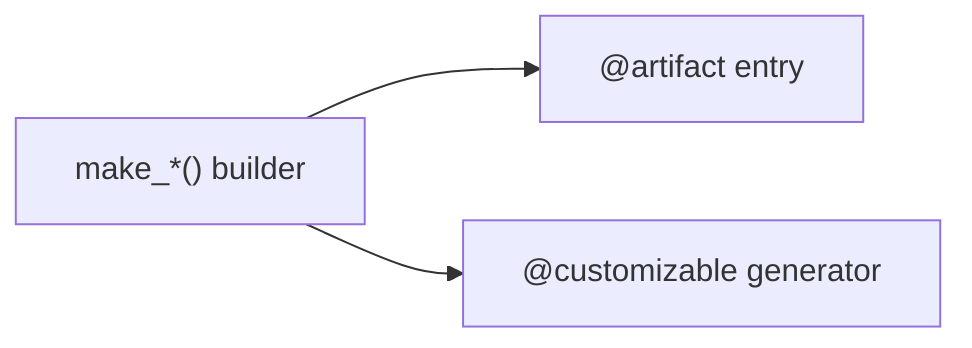

# Parts & assemblies

## Three-layer pattern

| Layer | Naming | Used by |
|-------|--------|---------|
| Builder | `make_<name>` | Tests, assemblies, MR wrappers |
| Artifact | `<name>` (noun) | `mr artifacts *`, releases |
| Generator | `<name>_generator` | `mr generators *` |

One module per part family: `cad/parts/sphere.py`, `cad/assemblies/demo_widget.py`.

## Layering rules

**Do:**

- Put reusable geometry in `cad/parts/`
- Compose products in `cad/assemblies/` — import from `cad.parts`
- Expose `@artifact` / `@customizable` on entry points in those modules

**Do not:**

- Put assembly composition logic in `cad/parts/`
- Copy-paste part geometry into `cad/assemblies/`
- Add `@artifact` to `main.py` or bare `make_*` builders

## Parts vs assemblies

| | Part | Assembly |
|---|------|----------|
| **Identity** | Single reusable component | Product composed from parts |
| **Location** | `cad/parts/` | `cad/assemblies/` |
| **Responsibility** | Geometry, parameters, holes | Placement, patterns, mates |
| **Returns** | `Part` or `Compound` | Single `Compound` (or fused `Part`) |

## Cutout / reference alignment

When embedding hardware (nuts, bearings, inserts, any other parts), generate a volumetric solid based on the part and scale the volume to achieve a desired margin between the surfaces to account for margin of error in manufacturing processes. It's important that the part and its cutout volume reference and reflect the properties of the part; never compute placement from different faces, avoid volumes not sharing alignment with their parts, etc.

Live example: [`cad/parts/sphere.py`](https://github.com/Coffee2Bits/CAD-as-Code-Template/blob/main/cad/parts/sphere.py) (M3 nut pocket and screw clearance hole), [`cad/parts/m3_socket_head_cap_screw.py`](https://github.com/Coffee2Bits/CAD-as-Code-Template/blob/main/cad/parts/m3_socket_head_cap_screw.py), and [`cad/assemblies/demo_sphere.py`](https://github.com/Coffee2Bits/CAD-as-Code-Template/blob/main/cad/assemblies/demo_sphere.py).

After building the assembly, use the OCP CAD Viewer [Clip tab](/getting-started/ocp-viewer#clip-view-section-cuts) to confirm the reference nut and screw sit flush in their seats — a Y-axis section cut makes the pocket alignment easy to read.

<small><em>The Y-axis clip makes the nut pocket, clearance bore, and hardware reference alignment visible before export or printing.</em></small>

Agents: full rules in [AGENTS.md](https://github.com/Coffee2Bits/CAD-as-Code-Template/blob/main/AGENTS.md).
