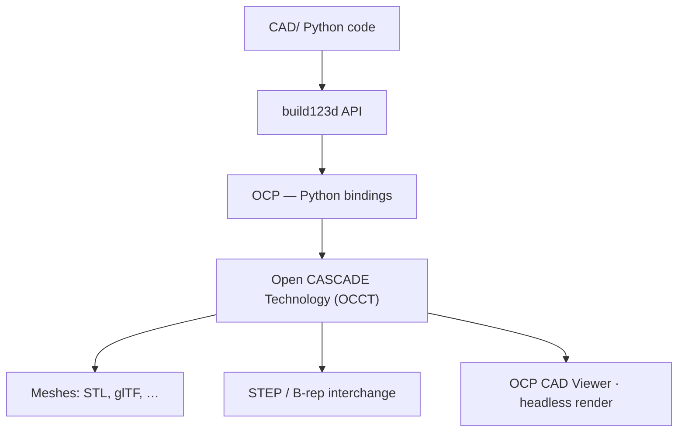

# Open CASCADE

[Open CASCADE Technology](https://dev.opencascade.org/) (OCCT) is the open-source **B-rep CAD kernel** underneath [build123d](https://build123d.readthedocs.io/). When you sketch, extrude, fillet, or export STEP in this workspace, the solid modeling work happens in OCCT — build123d is the Python layer on top.

:::note Not OpenSCAD

**Open CASCADE** (OCCT) is a full CAD kernel for boundary-representation solids. **[OpenSCAD](https://openscad.org/)** is a separate script-based CSG modeler. This template uses the former via build123d, not OpenSCAD.

:::

## How it fits the stack

| Layer | What it is |
|-------|------------|
| **build123d** | Parametric Python API you author in the **CAD/** tree (`cad/`) |
| **OCP** | [Open CASCADE Python](https://github.com/CadQuery/OCP) bindings — `TopoDS_Shape`, exporters, AIS display |
| **OCCT** | C++ kernel — booleans, fillets, tessellation, STEP I/O |

## Where you see OCCT in this repo

- **Modeling** — every `Part` / `Compound` from build123d wraps OCCT topology
- **OCP CAD Viewer** — displays `TopoDS_Shape` via the AIS pipeline
- **`cad_tooling.render`** — headless PNG export through OCP (`V3d_Viewer`, `AIS_Shape`)
- **Export** — STEP and STL writers in Open CASCADE
- **Dev container / CI/CD pipeline** — `.devcontainer/Dockerfile` installs OCCT system libs and Mesa so local, viewer, and Dagger environments match

## Official resources

| Resource | Link |
|----------|------|
| Developer portal | [dev.opencascade.org](https://dev.opencascade.org/) |
| Documentation | [OCCT docs](https://dev.opencascade.org/doc/overview/html/index.html) |
| Source | [Open-Cascade-SAS/OCCT](https://github.com/Open-Cascade-SAS/OCCT) |
| build123d | [build123d.readthedocs.io](https://build123d.readthedocs.io/) |
| OCP bindings | [CadQuery/OCP](https://github.com/CadQuery/OCP) |

## Practical notes

- **STEP** is the most faithful interchange format OCCT offers; STL is a tessellated snapshot.
- Selector-based operations (faces, edges) depend on stable topology — refactors that change face order can break selectors.
- Headless rendering in the CI/CD pipeline uses Xvfb when `DISPLAY` is unset; see [CAD tooling render](/tools/cad-tooling/render).

## Related

- [Glossary](/reference/glossary) — OCP vs build123d terms
- [Stack architecture](/) — full workspace diagram
- [Dev container](/getting-started/dev-container) — OCCT/Mesa parity with the CI/CD pipeline
