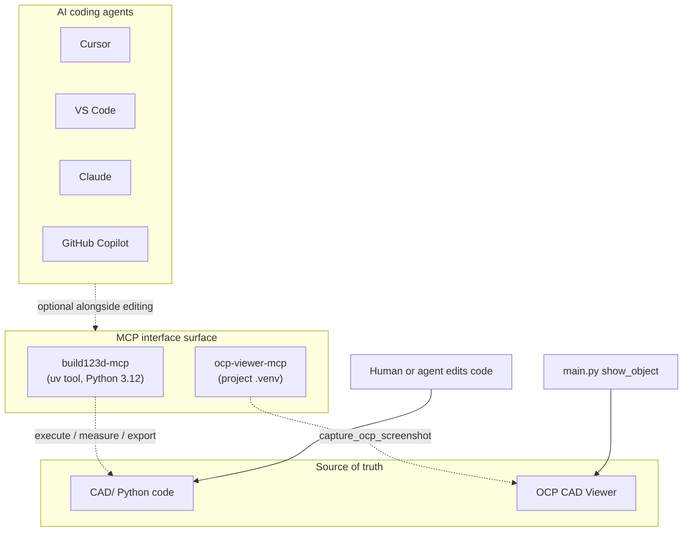

# MCP servers

MCP servers are an **agent interface surface** — they sit alongside the IDE and direct code editing, giving AI assistants (Cursor, VS Code, Claude, GitHub Copilot) structured tools to interact with geometry and the viewer. They do **not** replace the **CAD/** tree (`cad/` on disk) as the source of truth; stable work still lands in Python modules under version control.



## Configured servers

| Server | Package | Pin | Role |
|--------|---------|-----|------|
| [build123d-mcp](https://github.com/pzfreo/build123d-mcp) | build123d-mcp | 0.3.36 | Sandboxed build123d execution; measure, render, export |
| [ocp-viewer-mcp](https://github.com/dmilad/ocp-viewer-mcp) | ocp-viewer-mcp | 0.1.0 | Screenshots from OCP CAD Viewer for agent vision |

### build123d-mcp

Runs in an isolated `uv tool` environment (Python 3.12 required for VTK/OCP wheels).

| Tool | Purpose |
|------|---------|
| `execute` | Run build123d code in a sandboxed session |
| `measure` | Bounding box, volume, validity |
| `render_view` | Headless geometry preview |
| `export` | Export from sandbox session |
| `session_state` | Inspect current session |

### ocp-viewer-mcp

Runs from the project `.venv` inside the dev container. Requires the OCP CAD Viewer extension and a model displayed via `show_object()`.

| Tool | Purpose |
|------|---------|
| `capture_ocp_screenshot` | Screenshot of current OCP CAD Viewer display |

## In the dev container

Both MCP servers are **part of the dev container stack** — no host-side install. When your IDE attaches via [Dev Containers](/getting-started/dev-container), the servers run **inside** the same container as build123d, pytest, and the OCP viewer.

| Server | How it is provided | Launcher |
|--------|-------------------|----------|
| **ocp-viewer-mcp** | Dev dependency in [`pyproject.toml`](https://github.com/Coffee2Bits/CAD-as-Code-Template/blob/main/pyproject.toml); installed by `uv sync` on container create/start | [`.cursor/run-ocp-viewer-mcp.sh`](https://github.com/Coffee2Bits/CAD-as-Code-Template/blob/main/.cursor/run-ocp-viewer-mcp.sh) |
| **build123d-mcp** | Pinned `uv tool` environment (Python 3.12 in the container image) | [`.cursor/run-build123d-mcp.sh`](https://github.com/Coffee2Bits/CAD-as-Code-Template/blob/main/.cursor/run-build123d-mcp.sh) |

`postCreateCommand` / `postStartCommand` in [`devcontainer.json`](https://github.com/Coffee2Bits/CAD-as-Code-Template/blob/main/.devcontainer/devcontainer.json) run `uv sync` (which brings in `ocp-viewer-mcp`) and, on start, `post-start.sh` (which always runs `start-docs.sh` for the Docusaurus dev server). The launchers live under `.cursor/` and resolve paths relative to the workspace.

## Connecting your IDE

[`.cursor/mcp.json`](https://github.com/Coffee2Bits/CAD-as-Code-Template/blob/main/.cursor/mcp.json) wires both servers to those launchers:

```json
{
  "mcpServers": {
    "build123d-mcp": {
      "command": "bash",
      "args": [".cursor/run-build123d-mcp.sh"]
    },
    "ocp-viewer": {
      "command": "bash",
      "args": [".cursor/run-ocp-viewer-mcp.sh"]
    }
  }
}
```

| IDE | What you do |
|-----|-------------|
| **Cursor** | Open in Dev Container — `.cursor/mcp.json` is picked up automatically. After a container **rebuild**, reload MCP in **Settings → MCP**. |
| **VS Code / Codespaces + Copilot** | Reopen in Container, then add the same server entries from `.cursor/mcp.json` in your [MCP settings](https://code.visualstudio.com/docs/copilot/chat/mcp-servers) (launchers still run inside the container). |
| **Other MCP-capable clients** | Point server `command`/`args` at the same `.cursor/run-*.sh` scripts while attached to the dev container. |

There is nothing to install on the host — only connect the IDE to servers that already run in the container.

## Version bumps

Edit the launcher scripts, then reload MCP (**Settings → MCP**):

- `build123d-mcp==0.3.36` — in [`.cursor/run-build123d-mcp.sh`](https://github.com/Coffee2Bits/CAD-as-Code-Template/blob/main/.cursor/run-build123d-mcp.sh)
- `ocp-viewer-mcp` — version from [`pyproject.toml`](https://github.com/Coffee2Bits/CAD-as-Code-Template/blob/main/pyproject.toml) dev group; run `uv sync` after bumping

## Typical workflow

1. Use **build123d-mcp** `execute` to prototype geometry; verify with `measure` and `render_view`
2. Move stable parts into `cad/parts/` with pytest coverage
3. Assemble parts into broader assemblies for more complex models
4. Start `just view` in the background (agents) or foreground (humans) to display in OCP CAD Viewer — launch immediately after each geometry edit
5. Use **ocp-viewer-mcp** `capture_ocp_screenshot` for visual confirmation

After a container rebuild: `just sync`, then reload MCP in the IDE.

## Other MCP candidates (not configured)

| Repository | Description |
|------------|-------------|
| [brs077/3dp-mcp-server](https://github.com/brs077/3dp-mcp-server) | 3D-printable CAD with build123d (Bambu Lab X1C focus) |
| [jdilla1277/agentcad](https://github.com/jdilla1277/agentcad) | CAD CLI and MCP server for AI agents |
| [rishigundakaram/cadquery-mcp-server](https://github.com/rishigundakaram/cadquery-mcp-server) | CadQuery MCP server |
| [blwfish/freecad-mcp](https://github.com/blwfish/freecad-mcp) | FreeCAD MCP integration |

Not an endorsement — evaluate before adopting.

## Troubleshooting

See [MCP troubleshooting](/troubleshooting/mcp).
