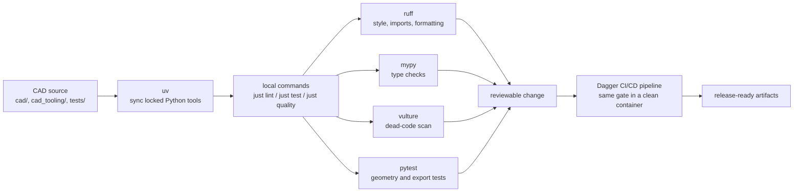

# uv and quality tools

This repo treats CAD models like software, so the toolchain does more than install Python packages. It keeps the workspace reproducible, formats source files, catches typing mistakes, flags dead code, and gives the CI/CD pipeline the same checks developers can run locally.

If you only remember one command, use this one before you push:

```bash
just quality
```

It runs the local quality gate: linting plus tests. Use the rest of this page when you need to understand what failed, run a smaller check, or change the tool configuration on purpose.

## How the pieces fit



The practical idea: catch the cheap problems before they become geometry problems. A formatting failure is easier to fix than a broken export found at release time.

## Command map

| Need | Command | What it proves |
|------|---------|----------------|
| Install or refresh tools | `just sync` | The workspace has the Python dependencies from `uv.lock`. |
| Match the CI/CD pipeline install | `just sync-frozen` | The lockfile is current and installable without changing it. |
| Format source files | `just format` | Ruff can rewrite formatting consistently. |
| Run static checks | `just lint` | Ruff, mypy, and vulture agree the source is clean. |
| Run geometry and export tests | `just test` | Pytest can build, inspect, and export the models under test. |
| Run the normal pre-push gate | `just quality` | Static checks and tests both pass. |
| Run the containerized CI/CD gate | `just ci` | Dagger can reproduce the check in the same style as GitHub Actions. |

For the full justfile reference, see [justfile recipes](/reference/justfile-recipes). For the Dagger side, see [CI/CD pipeline and Dagger](/workflows/ci-and-dagger).

## uv: the package and tool runner

[`uv`](https://docs.astral.sh/uv/) installs the project dependencies and runs commands inside the repo environment. In this template, it replaces the usual mix of `pip`, virtualenv commands, and hand-written activation steps.

Use:

```bash
just sync
```

when you change branches, edit dependencies, or open the repo in a fresh workspace.

Use:

```bash
just sync-frozen
```

when you want the same dependency strictness as the CI/CD pipeline. This should fail if `pyproject.toml` and `uv.lock` disagree.

Direct equivalents:

```bash
uv sync
uv sync --group dev --frozen
```

Dev dependencies include pytest, ruff, mypy, vulture, pre-commit, MakerRepo CLI support, MCP packages, and Dagger-facing tooling.

## Ruff: style, imports, and formatting

[`ruff`](https://docs.astral.sh/ruff/) is the formatter and first-pass linter. It keeps source files boring and consistent so reviews can focus on modeling changes instead of spacing, import order, or small style drift.

Run the check:

```bash
uv run ruff check .
uv run ruff format --check .
```

Apply formatting:

```bash
just format
```

Configuration lives in [`pyproject.toml`](https://github.com/Coffee2Bits/CAD-as-Code-Template/blob/main/pyproject.toml) under `[tool.ruff]`. The template uses a 100-character line length and Python 3.11 target.

The `cad/parts/*.py` files allow wildcard build123d imports (`F403`, `F405`) because that style is common in sketch-heavy CAD code. Keep that exception narrow; do not use it as a blanket escape hatch for the rest of the repo.

## mypy: type checks for CAD code

[`mypy`](https://mypy.readthedocs.io/) checks the shape of the Python code before runtime. That matters in CAD work because many failures otherwise show up late: during viewer startup, export, or a CI/CD pipeline job.

Run:

```bash
uv run mypy cad cad_tooling tests cad_tooling_tests
```

The checked paths match the CI/CD pipeline. Configuration lives in [`pyproject.toml`](https://github.com/Coffee2Bits/CAD-as-Code-Template/blob/main/pyproject.toml) under `[tool.mypy]`.

Current defaults:

| Setting | Why it exists |
|---------|---------------|
| `python_version = "3.11"` | Matches the supported runtime. |
| `explicit_package_bases = true` | Keeps package discovery predictable in this template layout. |
| `ignore_missing_imports = true` | Avoids blocking on third-party CAD libraries without complete type stubs. |

Prefer adding clear type hints at your own function boundaries over loosening the global mypy settings. Builders, exporters, and test helpers are much easier to review when their inputs and outputs are explicit.

## Vulture: dead-code detection

[`vulture`](https://github.com/jendrikseipp/vulture) scans for unused functions, classes, variables, and imports. In a CAD repo, this helps separate useful reusable geometry from old experiments that no longer feed an artifact, generator, test, or release export.

Run:

```bash
uv run vulture
```

Configuration lives in [`pyproject.toml`](https://github.com/Coffee2Bits/CAD-as-Code-Template/blob/main/pyproject.toml) under `[tool.vulture]`.

Current scan scope:

| Setting | Value |
|---------|-------|
| `paths` | `cad`, `cad_tooling`, `tests`, `cad_tooling_tests`, `main.py`, `scripts`, `ci/src` |
| `exclude` | `.venv`, `ci/.venv`, `ci/sdk`, `website`, `dist`, `__pycache__` |
| `min_confidence` | `80` |

Some framework entry points look unused to static analysis because decorators or external tools discover them. The template already ignores the common decorators:

| Decorator | Why it may look unused |
|-----------|------------------------|
| `@artifact`, `@customizable`, `@cached`, `@render` | MakerRepo discovers these at runtime. |
| `@function` | Dagger exposes decorated functions as pipeline calls. |
| `@pytest.fixture` | Pytest injects fixtures into tests by name. |

When vulture reports a false positive, do not delete live CAD code just to silence the check. First confirm whether the symbol is used through MakerRepo, Dagger, pytest, or another discovery path. If it is genuinely part of the public surface, add a focused ignore or whitelist entry and leave a short comment explaining why.

## Pytest: model behavior, not just code behavior

[`pytest`](https://docs.pytest.org/) runs the tests that prove the example CAD model still builds, exports, and behaves as expected.

Run everything:

```bash
just test
```

Pass extra pytest arguments through `just`:

```bash
just test -v tests/test_sphere.py
```

Good CAD tests usually assert observable properties:

| Assert | Why |
|--------|-----|
| Valid solids | Catches broken geometry before export. |
| Bounding boxes, volume, feature counts | Catches accidental dimensional changes. |
| Artifact discovery | Proves MakerRepo can find publishable objects. |
| Scoped export checks | Proves manufacturing outputs still generate. |

For modeling-specific examples, see [Testing](/modeling/testing).

## Editor alignment

Editor formatting should match the repo, not personal global settings. The Dev Container config and [`.vscode/settings.json`](https://github.com/Coffee2Bits/CAD-as-Code-Template/blob/main/.vscode/settings.json) point the editor at the environment version of Ruff and this repo's `pyproject.toml`.

Expected settings:

| Setting | Value |
|---------|-------|
| `editor.defaultFormatter` | Ruff |
| `ruff.importStrategy` | `fromEnvironment` |
| `ruff.configuration` | `${workspaceFolder}/pyproject.toml` |

Do not use Black, autopep8, or the built-in Python formatter for this repo. They can produce formatting that differs from the CI/CD pipeline, which turns simple saves into noisy diffs.

## Git hooks

Install the local hooks once per clone:

```bash
just setup-hooks
```

This installs:

| Hook | What it does |
|------|--------------|
| `pre-commit` | Runs Ruff check, Ruff format, and vulture before a commit is created. |
| `commit-msg` | Checks the commit subject follows the expected Conventional Commit shape. |

Hooks are a convenience, not a replacement for `just quality`. Run the full local gate before pushing meaningful changes.

## When a check fails

Use the failing tool name to choose the fix path.

| Failure | Usual fix |
|---------|-----------|
| `ruff check` | Read the rule message, fix the import/style issue, or run `uv run ruff check . --fix` when the rule is safely auto-fixable. |
| `ruff format --check` | Run `just format`, then inspect the diff. |
| `mypy` | Add or tighten types in your code. Avoid broad `# type: ignore` comments unless the library boundary really needs one. |
| `vulture` | Delete truly unused code, or add a focused ignore/whitelist for framework-discovered entry points. |
| `pytest` | Fix the model, expected dimensions, fixture, or export path. Do not loosen geometry assertions just to pass. |
| `just sync-frozen` | Regenerate or commit the correct `uv.lock` change, then rerun the frozen sync. |

A good repair loop is:

```bash
just lint
just test
just quality
```

Run the smallest command while debugging, then finish with the full local gate.

## Local gate vs CI/CD pipeline

`just quality` is the normal local gate. It is fast and does not require Docker.

`just ci` runs the Dagger pipeline. It needs Docker and is closer to what GitHub Actions runs for pull requests and main-branch changes.

Use `just ci` before merging larger changes, changing tooling, touching `.github/workflows/**`, or updating export/release behavior. Otherwise, `just quality` is the right daily habit.

## Related docs

- [Daily development](/workflows/daily-development) — where these checks fit in the edit/test/view loop.
- [Testing](/modeling/testing) — what CAD model tests should assert.
- [CI/CD pipeline and Dagger](/workflows/ci-and-dagger) — the containerized pipeline and GitHub Actions check.
- [Export and CI/CD pipeline troubleshooting](/troubleshooting/export-and-ci) — export and pipeline failures.
- [justfile recipes](/reference/justfile-recipes) — complete command reference.
- [Glossary](/reference/glossary) — short definitions for CAD-as-Code terms.
