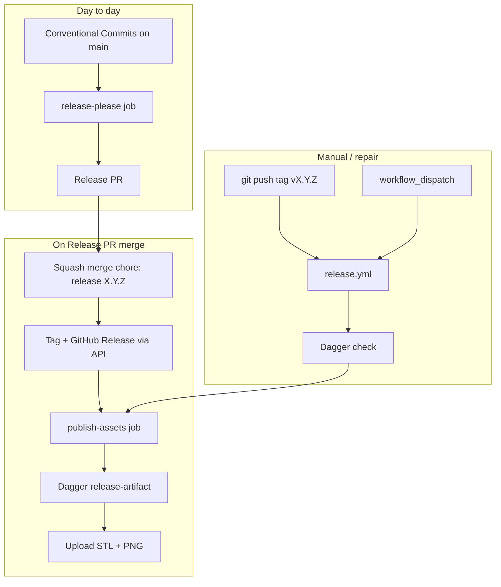

# Release Please & GitHub Releases troubleshooting

Automated releases use [release-please](https://github.com/googleapis/release-please) plus three workflows:

| Workflow | Trigger | Role |
|----------|---------|------|
| [`release-please.yml`](https://github.com/Coffee2Bits/CAD-as-Code-Template/blob/main/.github/workflows/release-please.yml) | Push to `main` | Open/update Release PRs; on merge, tag + export/upload STL/PNG |
| [`release-assets.yml`](https://github.com/Coffee2Bits/CAD-as-Code-Template/blob/main/.github/workflows/release-assets.yml) | `workflow_call` | Shared Dagger export + `softprops/action-gh-release` upload |
| [`release.yml`](https://github.com/Coffee2Bits/CAD-as-Code-Template/blob/main/.github/workflows/release.yml) | Tag push `vX.Y.Z` or `workflow_dispatch` | Manual tag fallback or repair run |

**Prerequisites:** [Set up GitHub](/getting-started/github-setup) (workflow permissions, squash merge) and read [Releases](/getting-started/releases) for the happy path.

## How the pieces connect



**Important:** release-please creates tags through the **GitHub API**. That does **not** emit a tag `push` event. Asset export must run inside `release-please.yml` (or via `release.yml` `workflow_dispatch`). Relying on tag push alone left [v0.3.0](https://github.com/Coffee2Bits/CAD-as-Code-Template/releases/tag/v0.3.0) with changelog text but no STL/PNG files.

## Quick routing

| Symptom | Jump to |
|---------|---------|
| No Release PR after `feat:` / `fix:` merge | [Release PR never opens](#release-pr-never-opens) |
| Release PR stuck / will not update | [Stale autorelease label](#release-pr-will-not-update) |
| `commit could not be parsed` in Actions log | [Unparsed merge commits](#commit-could-not-be-parsed) |
| Merged Release PR but no GitHub Release | [No release after merge](#no-github-release-after-merge) |
| `There are untagged, merged release PRs outstanding` | [Untagged merged Release PR](#untagged-merged-release-pr) |
| Release exists but no STL/PNG assets | [Missing release assets](#missing-release-assets) |
| `Resource not accessible by integration` | [403 on create-a-release](#resource-not-accessible-by-integration) |
| `release.yml` fails in 0s / workflow not valid | [Invalid workflow expressions](#invalid-workflow-if-expressions) |
| Tag push does nothing | [Tag push ignored](#tag-push-ignored) |
| Duplicate releases or tags | [Duplicate publish paths](#duplicate-publish-paths) |
| Export step fails in publish job | [Asset export failures](#asset-export-failures) |

---

## Release PR never opens

**Symptom:** You merged a `feat:` or `fix:` PR to `main`; no Release PR appears within a few minutes.

**Likely causes**

1. **Workflow permissions** — Settings → Actions → General must be **Read and write permissions** with **Allow GitHub Actions to create and approve pull requests** enabled. See [Actions workflow permissions](/getting-started/github-setup#actions-workflow-permissions).
2. **Commit type not releasable** — `chore:`, `ci:`, and `test:` commits do not open Release PRs on their own under `release-type: python`. You need at least one merged `feat:`, `fix:`, `docs:`, or `deps:` squash title since the last release.
3. **Failed workflow run** — Open Actions → **Release Please** on the `main` push and read the log.

**Fix**

1. Confirm permissions on GitHub.com.
2. Merge another releasable PR, or re-run **Release Please** (`workflow_dispatch`).
3. If a previous run left the repo in a bad state, see [Untagged merged Release PR](#untagged-merged-release-pr).

---

## Release PR will not update

**Symptom:** An old Release PR exists but new commits on `main` are not reflected in the version bump or changelog.

**Cause:** Stale `autorelease: pending` label on an **older** merged or abandoned Release PR. release-please refuses to proceed until that label is cleared ([upstream docs](https://github.com/googleapis/release-please#why-are-there-multiple-release-prs)).

**Fix**

1. Find PRs with label `autorelease: pending`.
2. Remove the label from stale PRs (or close abandoned Release PRs).
3. Re-run **Release Please** on `main`.

---

## Commit could not be parsed

**Symptom:** Release Please log contains `commit could not be parsed: Merge remote-tracking branch …` or similar.

**Cause:** A **merge commit** (not squash) landed on `main`. release-please expects linear Conventional Commit squash subjects.

**Fix**

- Prefer **squash merge** for all PRs to `main` (recommended in [GitHub setup](/getting-started/github-setup#merge-settings)).
- The warning is often harmless if later commits are valid; fix merge settings so it does not recur.
- Avoid `git merge` directly on `main` when contributing locally.

---

## No GitHub Release after merge

**Symptom:** Release PR merged, but Repository → Releases has no new `vX.Y.Z`.

**Likely causes**

1. **Wrong squash title** — The merge commit subject must be exactly `chore: release X.Y.Z` (release-please sets this on the Release PR). Do not edit the squash title when merging.
2. **Workflow syntax error** — A invalid `if:` expression in `.github/workflows/*.yml` can fail workflow validation before any job runs (historically `=~` instead of `matches()` in `release.yml`). Check Actions for a failed workflow file on `main`.
3. **`skip-github-release: true`** — Do not set this on `googleapis/release-please-action`. It leaves merged Release PRs without a GitHub Release and triggers [untagged merged Release PR](#untagged-merged-release-pr) errors later.

**Fix**

1. Confirm squash subject on the merge commit (`git log -1 --oneline main`).
2. Open the **Release Please** run for that push; confirm `release_created` was `true`.
3. If the release was never created, recover with [Untagged merged Release PR](#untagged-merged-release-pr).

---

## Untagged merged Release PR

**Symptom:** release-please log: `There are untagged, merged release PRs outstanding - aborting`.

**Cause:** A Release PR was squash-merged but no matching `vX.Y.Z` tag exists. Common when:

- `skip-github-release: true` was enabled (tag-only mode).
- The release-please step failed after merge.
- Someone deleted the tag manually.

**Fix**

1. Find the merged Release PR and its merge commit SHA (e.g. `chore: release 0.3.0`).
2. Remove stale `autorelease: pending` from that PR if still present.
3. Create the missing tag on the merge commit:
   ```bash
   git fetch origin
   git tag v0.3.0 <merge-commit-sha>
   git push origin v0.3.0
   ```
   Or use the GitHub UI: Releases → Draft → choose tag → create from merge commit.
4. Add label `autorelease: tagged` to the merged Release PR.
5. Re-run **Release Please** on `main`.
6. If the GitHub Release exists but assets are missing, use [Repair a broken release](#repair-a-broken-release).

---

## Missing release assets {#missing-release-assets}

**Symptom:** GitHub Release shows changelog text (or an empty asset list) but no `*.stl` / `*.png` files. Example: [v0.3.0](https://github.com/Coffee2Bits/CAD-as-Code-Template/releases/tag/v0.3.0) before the workflow fix.

**Cause:** Asset upload was wired only to `release.yml` on **tag push**. release-please creates tags via the **GitHub API**, which does not fire `on: push: tags:`. The **CI** workflow on `main` (`ci.yml`) is unrelated to release asset upload.

**What a healthy run looks like**

After merging a Release PR, Actions should show **Release Please** with two jobs:

1. **Create or update release PR** — succeeds (~seconds)
2. **Publish release assets** — succeeds (~8 minutes, Dagger export)

**Fix (repair existing release)**

1. Merge the workflow fix (or ensure `publish-assets` exists in `release-please.yml`).
2. Actions → **Release** → **Run workflow** → enter tag `v0.3.0` → Run.
3. Wait for **Quality gate** + **Publish release assets** to finish.
4. Confirm assets: `gh release view v0.3.0 --repo OWNER/REPO`

**Fix (future releases)** — Keep asset publish in `release-please.yml` via `release-assets.yml`; do not assume tag push alone will upload files.

---

## Resource not accessible by integration

**Symptom:** `403` or `Resource not accessible by integration` on `create-a-release` or `gh release`.

**Likely causes**

1. **Released commit changes `.github/workflows/`** — GitHub enforces extra scope for releases that ship workflow file changes. `GITHUB_TOKEN` cannot declare `workflows: write` in workflow YAML ([invalid scope](https://github.com/cli/cli/issues/9514#issuecomment-2312631960)); merge workflow fixes in a separate PR before the Release PR, or use a PAT/GitHub App with `workflows` scope ([enforcement changelog](https://github.blog/changelog/2023-11-02-github-actions-enforcing-workflow-scope-when-creating-a-release/)).
2. **Duplicate publish steps** — Both release-please and a custom `gh release create` step tried to publish in the same workflow (fixed in template by a [single publish path](https://github.com/Coffee2Bits/CAD-as-Code-Template/commit/1e42951)).
3. **Repo workflow permissions** still read-only — see [Release PR never opens](#release-pr-never-opens).
4. **Local `gh` push of workflow changes** without `workflow` OAuth scope — refresh with `gh auth refresh -s workflow` when editing `.github/workflows/` locally (CI uses `GITHUB_TOKEN` and does not need this).

**Fix**

- Merge `.github/workflows/` changes to `main` **before** merging the Release PR when possible so the tagged commit only bumps version/changelog.
- Use only `release-please.yml` + `release-assets.yml` + `release.yml` — do not add parallel `gh release create` steps.
- Do not run `gh release create` for normal publishes ([single publish path](/getting-started/releases#single-publish-path)).
- Confirm **Read and write** workflow permissions on the repository.

---

## Invalid workflow `if` expressions

**Symptom:** `release.yml` (or another workflow) shows **failure in 0s** with no job logs, often on the same push as a Release PR merge.

**Cause:** GitHub Actions rejected the workflow file at parse time. The template once used `if: github.ref_name =~ '^v…'` — `=~` is not valid; use `matches(github.ref_name, '^v…')` ([fix commit](https://github.com/Coffee2Bits/CAD-as-Code-Template/commit/aeb1b67)).

**Fix**

1. Actions → failed workflow → confirm "workflow file issue" or missing jobs.
2. Validate `if:` expressions against [GitHub Actions expressions](https://docs.github.com/en/actions/learn-github-actions/expressions).
3. Merge the fix, then recover the release per [Missing release assets](#missing-release-assets) or [Untagged merged Release PR](#untagged-merged-release-pr).

---

## Tag push ignored

**Symptom:** You ran `just version-tag` or `git push origin v1.0.0` but no **Release** workflow ran.

**Likely causes**

1. **Tag pattern** — `release.yml` only matches strict semver: `v[0-9]+.[0-9]+.[0-9]+`. Tags like `v0.1.0-test` or `v0.1.0-rc1` are **ignored** by design.
2. **Tag already exists** on GitHub — pushing the same tag again may not re-trigger unless forced (avoid force-pushing release tags on `main` repos).
3. **Workflow disabled** or workflow file missing on the tagged commit.

**Fix**

- Use `v1.2.3` format only for automated publish.
- For repair without re-tagging, use **Release** → `workflow_dispatch` with the existing tag name.
- Prefer the release-please Release PR path for changelog discipline.

---

## Duplicate publish paths

**Symptom:** Two releases for one version, missing assets on one, or 403 errors mid-workflow.

**Cause:** Historically the template tried to publish from both release-please **and** a tag-triggered job **and** manual `gh release` steps. Only one path should create/update the release and attach assets.

**Current design**

| Path | Creates release? | Uploads STL/PNG? |
|------|------------------|----------------|
| Merge Release PR | release-please (API) | `publish-assets` in `release-please.yml` |
| Push `vX.Y.Z` tag | `softprops/action-gh-release` in `release.yml` | same `release-assets.yml` |
| `workflow_dispatch` | Updates existing release | same `release-assets.yml` |

**Fix:** Remove extra `gh release create` / duplicate upload steps. Inspect with `gh release list` and delete erroneous drafts if needed.

---

## Asset export failures

**Symptom:** **Publish release assets** fails during Dagger `release-artifact` or `release-notes`, or succeeds but the release has no STL/PNG files.

**Likely causes**

1. **No releasable artifacts** — Only `@artifact` functions that also declare `@render` are included in release bundles. Run `just mr-artifacts` and confirm names.
2. **Export smoke failure** — Geometry or import error in `cad/`. Run `just export-smoke` or `just ci` locally.
3. **Missing PNG for a render** — Each `@render` on an artifact needs a matching exported PNG. See [Export and CI/CD pipeline troubleshooting](/troubleshooting/export-and-ci#release-png-missing).
4. **Empty `dist/` after export** — `release-assets.yml` sets `fail_on_unmatched_files: true` so a green run cannot upload zero assets silently.
5. **Dagger / Docker unavailable** on the runner — rare on `ubuntu-latest`; compare with [Dagger troubleshooting](/troubleshooting/dagger-and-docker).

**Fix**

```bash
just export-smoke
just release dist/
just release-notes v0.0.0
```

Fix model code until local release export succeeds, then re-run the failed workflow.

---

## Repair a broken release

Use this checklist when a version tag exists but the release is incomplete.

### 1. Inspect current state

```bash
gh release view v0.3.0 --repo OWNER/REPO
gh run list --workflow=release-please.yml --repo OWNER/REPO --limit 5
gh run list --workflow=release.yml --repo OWNER/REPO --limit 5
```

### 2. Choose a recovery action

| State | Action |
|-------|--------|
| No GitHub Release | [Untagged merged Release PR](#untagged-merged-release-pr) |
| Release exists, no assets | **Release** workflow → `workflow_dispatch` → tag `v0.3.0` |
| Assets wrong after model fix | Re-run `workflow_dispatch` (`overwrite_files` defaults to true on `softprops/action-gh-release`; body may duplicate if `append_body` ran before) |
| Entire release wrong version | Do not delete tags lightly; open an issue or cut `v0.3.1` with a fix forward |

### 3. Verify

- Release page lists `*.stl` and `*.png` for each `@render` artifact.
- Preview images in the release body use `releases/download/vX.Y.Z/` URLs ([release notes](/tools/cad-tooling/release-notes)).
- Optional: `gh release download v0.3.0 --repo OWNER/REPO`

---

## Override release notes after merge

If the squash title was wrong but the PR is already on `main`, edit the **merged PR description** on GitHub.com and add:

```text
BEGIN_COMMIT_OVERRIDE
feat(sphere): correct subject for changelog
END_COMMIT_OVERRIDE
```

Re-run release-please or wait for the next push to `main`. See [AGENTS.md — Fixing release notes](https://github.com/Coffee2Bits/CAD-as-Code-Template/blob/main/AGENTS.md#fixing-release-notes-after-merge).

---

## Related docs

- [Releases (getting started)](/getting-started/releases) — first release checklist
- [Releases workflow](/workflows/releases) — Conventional Commits reference and dry-run commands
- [Set up GitHub](/getting-started/github-setup) — permissions, branch protection, Pages
- [Export and CI/CD pipeline troubleshooting](/troubleshooting/export-and-ci) — artifact discovery and `@render`
- [release-please upstream](https://github.com/googleapis/release-please) — labels, manifest, and config reference
