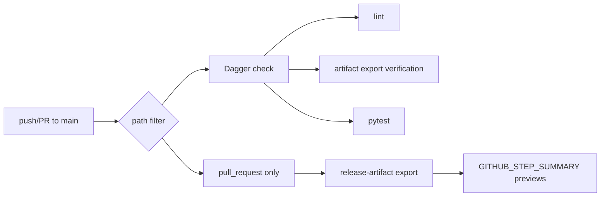

# CI/CD pipeline and Dagger



## GitHub Actions

[`ci.yml`](https://github.com/Coffee2Bits/CAD-as-Code-Template/blob/main/.github/workflows/ci.yml) runs on push and pull requests to `main` when these paths change:

- `cad/**`, `tests/**`, `ci/**`
- `.github/workflows/**`
- `pyproject.toml`, `uv.lock`, `.makerrepo/**`

Job name for branch protection: **Dagger CI**.

On **pull requests**, after the quality gate passes, CI exports `@render` PNG previews and appends them to the job summary (`GITHUB_STEP_SUMMARY`) so reviewers can inspect geometry without checking out the branch. Push events to `main` skip the preview export step.

## Dagger functions

| Function | What it runs |
|----------|--------------|
| `check` | lint + artifacts + test |
| `lint` | ruff check, ruff format --check, mypy, vulture |
| `test` | `uv run pytest` |
| `artifacts` | `python -m cad_tooling.export smoke` |
| `release-artifact` | `python -m cad_tooling.export release --lighting-preset default` |

Full reference: [CI functions](/reference/ci-functions).

## What the artifacts stage tests

The `artifacts` stage is not a smoke test of Dagger or GitHub Actions. It is the CI/CD pipeline's export verification for publishable CAD geometry.

The command name is still `cad_tooling.export smoke`, but the invariant is concrete: discover every MakerRepo `@artifact`, realize each artifact, then export the set as STEP and STL inside the CI container.

That catches failures that narrower tests can miss:

- an artifact was added but not discoverable through MakerRepo
- a model builds in one test path but fails when realized through the artifact registry
- STEP export works but STL export fails, or the reverse
- a registered artifact has no dedicated model test yet

Keep this separate from `test` on purpose. `test` runs pytest suites for model behavior, tooling behavior, and functional workflows. `artifacts` proves the repository's published CAD outputs still export as a full set.

For the full testing layer map, see [Testing strategy](/modeling/testing).

## Local

```bash
just ci
just ci-test
just ci-lint
just ci-artifacts
just ci-release dist/
```

Equivalent:

```bash
dagger call -m ./ci check --source=.
dagger call -m ./ci test --source=.
dagger call -m ./ci lint --source=.
dagger call -m ./ci artifacts --source=.
dagger call -m ./ci release-artifact --source=. export --path=./dist
```

### Requirements

1. Host **Docker** running
2. `/var/run/docker.sock` mounted in devcontainer (`devcontainer.json`)
3. Run from repo root inside the container

Pipeline builds from `.devcontainer/Dockerfile` for [Open CASCADE](/reference/open-cascade) / Mesa parity with local dev.

## Not in the CI/CD pipeline

- OCP CAD Viewer VSIX install
- MCP servers

## Related

- [Set up GitHub](/getting-started/github-setup) — branch protection, required checks
- [Dagger troubleshooting](/troubleshooting/dagger-and-docker)
