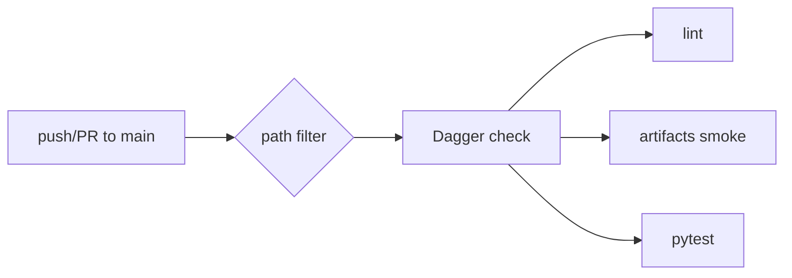

# CI & Dagger



## GitHub Actions

[`ci.yml`](https://github.com/Coffee2Bits/CAD-as-Code-Template/blob/main/.github/workflows/ci.yml) runs on push and pull requests to `main` when these paths change:

- `cad/**`, `tests/**`, `ci/**`
- `.github/workflows/**`
- `pyproject.toml`, `uv.lock`, `.makerrepo/**`

Job name for branch protection: **Dagger CI**.

## Dagger functions

| Function | What it runs |
|----------|--------------|
| `check` | lint + artifacts + test |
| `lint` | ruff check, ruff format --check, mypy |
| `test` | `uv run pytest` |
| `artifacts` | `python -m cad_tooling.export smoke` |
| `release-artifact` | `python -m cad_tooling.export release` |

Full reference: [CI functions](/reference/ci-functions).

## Local

```bash
just ci
just ci-test
just ci-lint
just ci-artifacts
just ci-release dist/
```

Equivalent:

```bash
dagger call -m ./ci check --source=.
dagger call -m ./ci test --source=.
dagger call -m ./ci lint --source=.
dagger call -m ./ci artifacts --source=.
dagger call -m ./ci release-artifact --source=. export --path=./dist
```

### Requirements

1. Host **Docker** running
2. `/var/run/docker.sock` mounted in devcontainer (`devcontainer.json`)
3. Run from repo root inside the container

Pipeline builds from `.devcontainer/Dockerfile` for [Open CASCADE](/reference/open-cascade) / Mesa parity with local dev.

## Not in CI

- OCP CAD Viewer VSIX install
- MCP servers

## Related

- [Set up GitHub](/getting-started/github-setup) — branch protection, required checks
- [Dagger troubleshooting](/troubleshooting/dagger-and-docker)
