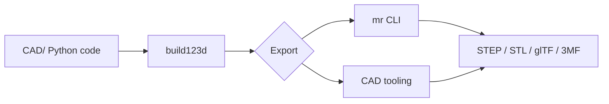

# Export & formats

## Format matrix

| Format | Use |
|--------|-----|
| STEP | CAD interchange (preferred handoff) |
| STL / 3MF | 3D printing meshes |
| GLB / glTF | Web preview |
| SVG / DXF | 2D profiles, laser cutting |

STEP is reliable; STL is lossy. Initial implementation covers STEP, STL, and GLB.

## Export paths

| Task | Command |
|------|---------|
| Single artifact | `just mr-export sphere /tmp/out step` |
| Headless PNG (one artifact) | `just render-artifact sphere /tmp/out` |
| All artifacts (smoke) | `just export-smoke` |
| Release bundle | `just release dist/` |
| Ad-hoc geometry | `cad_tooling.export.export_part()` |

See [MakerRepo](/tools/makerrepo), [CAD tooling export](/tools/cad-tooling/export), and [CAD tooling render](/tools/cad-tooling/render).
