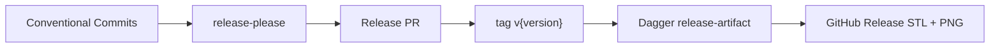

# Releases

:::tip New repository from the template?
Start with [Releases in Getting started](/getting-started/releases) for the first-release checklist and GitHub prerequisites, then return here for reference detail.
:::



## release-please flow

1. Merge PRs to `main` with [Conventional Commit](https://www.conventionalcommits.org/) squash titles (`feat:`, `fix:`, `docs:`, `deps:`)
2. [`release-please.yml`](https://github.com/Coffee2Bits/CAD-as-Code-Template/blob/main/.github/workflows/release-please.yml) opens or updates a **Release PR** (`chore: release X.Y.Z`)
3. Merge the Release PR → workflow detects squash subject → exports assets → creates GitHub Release

Config: [`release-please-config.json`](https://github.com/Coffee2Bits/CAD-as-Code-Template/blob/main/release-please-config.json) (`release-type: python`).

## Set up GitHub first

Before release-please can open Release PRs, configure workflow permissions, squash merge, and branch protection on GitHub.com:

- [Set up GitHub for your repository](/getting-started/github-setup) — full checklist for template clones
- [Releases (getting started)](/getting-started/releases) — first release walkthrough

## Conventional Commits (summary)

| Prefix | Release impact |
|--------|----------------|
| `feat:` | Minor bump |
| `fix:` | Patch bump |
| `feat!:` / `fix!:` / `BREAKING-CHANGE:` | Major bump |
| `docs:`, `deps:` | Releasable (Python strategy) |
| `chore:`, `ci:`, `test:` | No Release PR entry on their own |

Squash-merge PRs — the **PR title** becomes the changelog entry release-please parses.

## Version commands

| Command | Purpose |
|---------|---------|
| `just version-bump` | Local patch bump (`uv version --bump`) |
| `just version-bump minor` | Local minor bump |
| `just version-tag` | Manual tag push (triggers `release.yml`) |

Version lives in `pyproject.toml`; tags use `v` prefix (`0.1.1` → `v0.1.1`).

## What gets published

On release (Release PR merge or manual tag):

1. **Quality gate** — Dagger `check` (lint, artifact smoke, pytest)
2. **Export** — `@artifact` models that declare `@render` as STL + PNG
3. **GitHub Release** — `dist/*.stl`, `dist/*.png`, generated body with embedded preview images

Release notes format: [`.github/release_template.md`](https://github.com/Coffee2Bits/CAD-as-Code-Template/blob/main/.github/release_template.md)

## Local dry-run

Set [`template.repo.toml`](/getting-started/template-and-init#replace-the-template-identity) first, then:

```bash
just release dist/
just release-notes v0.1.0
```

Or with explicit repo slug:

```bash
uv run python -m cad_tooling.export release -o dist/
uv run python -m cad_tooling.export release-notes \
  --assets-dir dist \
  --repo YOUR_ORG/YOUR_REPO \
  --tag v0.1.0 \
  -o dist/RELEASE_BODY.md
```

## Manual tag fallback

`just version-tag` or push a strict semver tag (`vX.Y.Z` only) triggers [`release.yml`](https://github.com/Coffee2Bits/CAD-as-Code-Template/blob/main/.github/workflows/release.yml). Tags with suffixes (for example `v0.1.0-test`) are ignored by the publish job.

## Publish flow

1. `release-please.yml` — Release PRs + git tag on merge (`skip-github-release: true`)
2. `release.yml` — export and GitHub Release on tag push

Do not use `gh release create` for normal publishes. Release assets should come from the configured CI/CD pipeline so exports stay reproducible.

## Release note URLs

Use absolute `releases/download/{tag}/` URLs — see [Release notes](/tools/cad-tooling/release-notes).

Force a specific version: empty commit with `Release-As: x.y.z` in body ([release-please docs](https://github.com/googleapis/release-please#how-do-i-change-the-version-number)).
